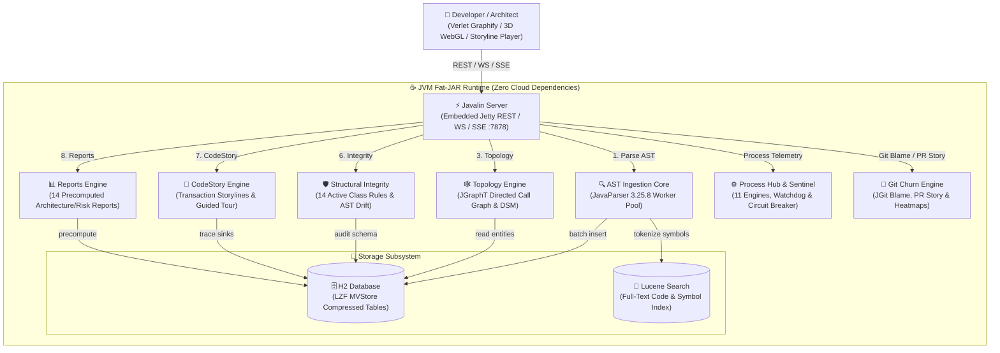
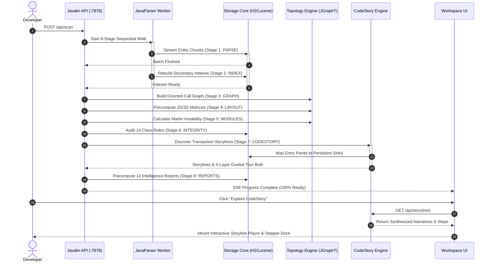
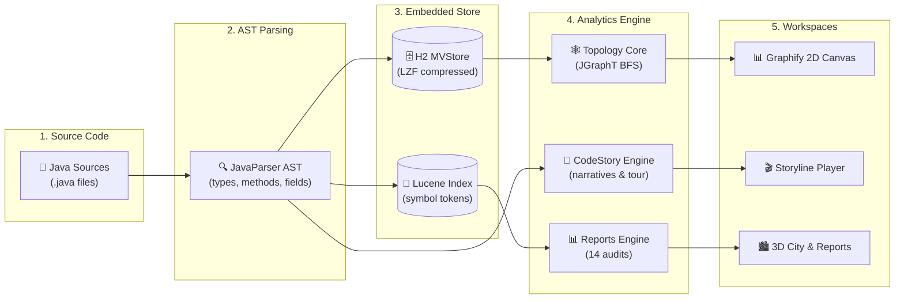
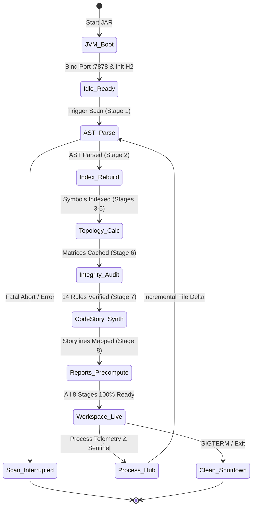

# CodeLens — Project Context & System Architecture

> **Java Codebase Intelligence, AST Architecture & CodeStory Exploration Platform**  
> 100% offline self-contained codebase intelligence tool scanning Java source code to extract AST hierarchies, JGraphT call graphs, field mutation propagation, structural integrity audits, transaction storylines, and 2D/3D visualizers.

---

## 🏛️ System Architecture

Interactive Archify HTML: [`docs/diagrams/architecture.html`](./docs/diagrams/architecture.html)  
Specification: [`docs/diagrams/architecture.json`](./docs/diagrams/architecture.json)

---

## 🔄 8-Stage Ingestion & Analysis Workflow

Interactive Archify HTML: [`docs/diagrams/workflow.html`](./docs/diagrams/workflow.html)  
Specification: [`docs/diagrams/workflow.json`](./docs/diagrams/workflow.json)

```mermaid
flowchart LR
    A["Scan Trigger\n(CLI / Web UI)"] --> B["1. Parse AST\n(JavaParser walk)"]
    B --> C["2. Index\n(Lucene & H2)"]
    C --> D["3. Topology\n(JGraphT call graph)"]
    D --> E["4. Layouts\n(Sunflower 2D/3D)"]
    E --> F["5. Modules\n(Coupling & stability)"]
    F --> G["6. Integrity\n(14 class rules)"]
    G --> H["7. CodeStory\n(Storylines & tour)"]
    H --> I["8. Reports\n(14 precomputed)"]
    I --> J["Complete & Ready\n(100% features live)"]
```

---

## ⚡ 8-Stage Scan & CodeStory Execution Sequence

Interactive Archify HTML: [`docs/diagrams/sequence.html`](./docs/diagrams/sequence.html)  
Specification: [`docs/diagrams/sequence.json`](./docs/diagrams/sequence.json)

---

## 🌊 Ingestion & CodeStory Data Flow Pipeline

Interactive Archify HTML: [`docs/diagrams/dataflow.html`](./docs/diagrams/dataflow.html)  
Specification: [`docs/diagrams/dataflow.json`](./docs/diagrams/dataflow.json)

---

## ⏱️ Server & Ingestion Lifecycle

Interactive Archify HTML: [`docs/diagrams/lifecycle.html`](./docs/diagrams/lifecycle.html)  
Specification: [`docs/diagrams/lifecycle.json`](./docs/diagrams/lifecycle.json)

---

## 📦 Subsystem Architecture & Modules

| Module | Responsibility | Core Technologies |
|---|---|---|
| `codelens-core` | Domain entities, configuration models, progress tracking, and zero-dependency DTOs. | Pure Java 17 |
| `codelens-parser` | High-throughput parallel AST parsing, type hierarchy extraction, and field reference detection. | JavaParser 3.25.8 |
| `codelens-storage` | Embedded transactional persistence, bulk chunk insertion, MVStore compression, and full-text code search. | H2 Database 2.2.224, Apache Lucene 9.10.0, HikariCP |
| `codelens-analysis` | Directed call graphs, field mutation propagation, DSM permutation, Martin instability metrics, structural integrity audit, and 14 intelligence reports. | JGraphT 1.5.2, Custom Graph Algorithms |
| `codelens-git` | Git history analysis, author blame attribution, commit frequency scoring, churn heatmap calculation, and Git PR change storylines. | Eclipse JGit 6.9.0 |
| `codelens-api` | Lightweight REST routing, Server-Sent Events (SSE) streaming, WebSocket channels, CodeStory narrative synthesis, and JVM diagnostic controls. | Javalin 6.1.3, Jetty 11 |
| `codelens-web` | Client-side application featuring 2D Graphify Canvas, 3D Software City/Galaxy, Hierarchical Treemap/Sunburst, Storyline Player, and Monaco Editor. | Native ES6, Three.js, Monaco Editor, Lucide Icons |
| `codelens-app` | Application entry point, CLI subcommand runner (`scan`, `story`, `trace`, `what-if`, `ask`, `explain`, `teach-me`, `pr-story`), and shaded fat-JAR packager. | Maven Shade Plugin |

---

## 🚀 Key Architectural Guarantees

1. **100% Offline & Air-Gapped**: Zero external CDN calls, zero cloud telemetry, and zero mandatory external database services.
2. **Deterministic & Sequential Readiness**: The scan engine enforces all 8 stages (`PARSE`, `INDEX`, `GRAPH`, `LAYOUT`, `MODULES`, `INTEGRITY`, `CODESTORY`, `REPORTS`) sequentially, guaranteeing that every downstream view and report is fully populated before completion is declared.
3. **High-Scale Performance**: Handles 125,000+ classes via LZF page compression, Level-of-Detail (LOD) viewport culling, and sparse matrix representations.
4. **Self-Healing JVM Operations**: Integrated Process Hub monitors 11 background worker engines, featuring automated heap pressure detection, adaptive cache shedding, and an emergency memory circuit breaker.
