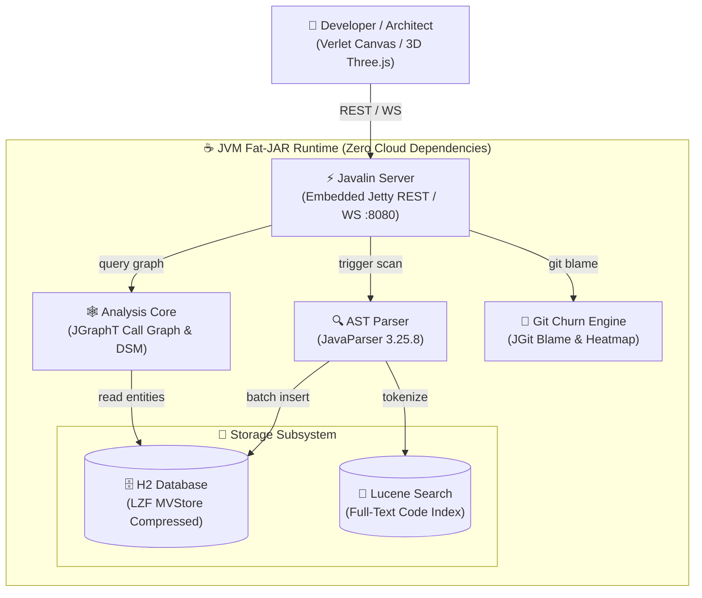
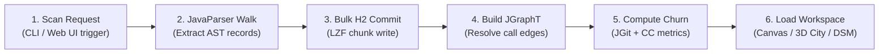
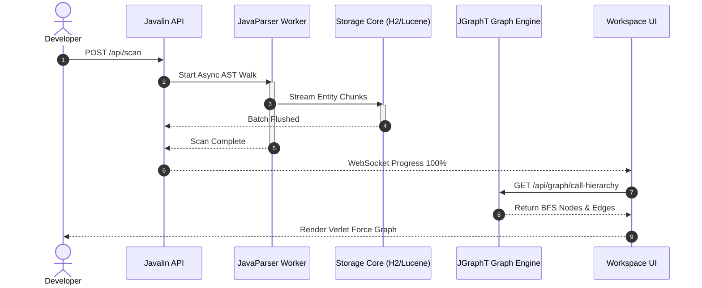
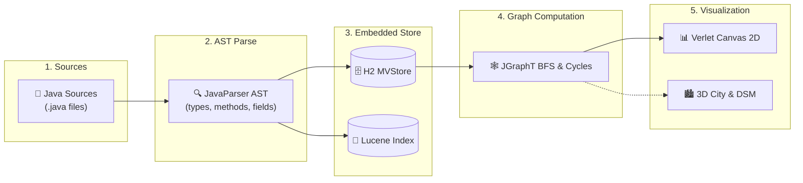
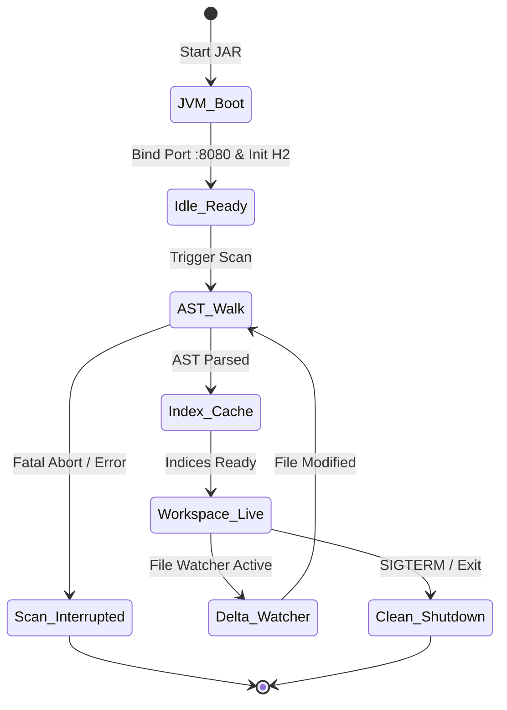

# CodeLens — Project Context & System Architecture

> **Java Codebase Intelligence & AST Architectural Exploration Platform**  
> 100% offline self-contained codebase intelligence tool scanning Java source code to extract AST hierarchies, JGraphT call graphs, field mutation propagation, and 3D visualizers.

---

## 🏛️ System Architecture

Interactive Archify HTML: [`docs/diagrams/architecture.html`](./docs/diagrams/architecture.html)  
Specification: [`docs/diagrams/architecture.json`](./docs/diagrams/architecture.json)

---

## 🔄 Ingestion & Analysis Workflow

Interactive Archify HTML: [`docs/diagrams/workflow.html`](./docs/diagrams/workflow.html)  
Specification: [`docs/diagrams/workflow.json`](./docs/diagrams/workflow.json)

---

## ⚡ Scan & Call Graph Execution Sequence

Interactive Archify HTML: [`docs/diagrams/sequence.html`](./docs/diagrams/sequence.html)  
Specification: [`docs/diagrams/sequence.json`](./docs/diagrams/sequence.json)

---

## 🌊 Ingestion Data Flow Pipeline

Interactive Archify HTML: [`docs/diagrams/dataflow.html`](./docs/diagrams/dataflow.html)  
Specification: [`docs/diagrams/dataflow.json`](./docs/diagrams/dataflow.json)

---

## ⏱️ Server & Ingestion Lifecycle

Interactive Archify HTML: [`docs/diagrams/lifecycle.html`](./docs/diagrams/lifecycle.html)  
Specification: [`docs/diagrams/lifecycle.json`](./docs/diagrams/lifecycle.json)

