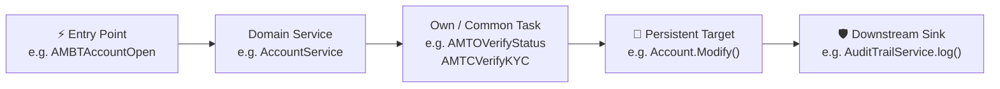

# CodeLens — Java Codebase Intelligence Platform

A high-performance, **100% offline**, self-contained Java codebase intelligence and architectural exploration tool. Scan any Java source repository to extract Abstract Syntax Trees (AST), map dependency and call hierarchies, investigate repository-wide field mutation impacts, identify structural drift, audit Git author churn, and inspect source files with syntax highlighting — all served locally through an interactive cyber-dark web interface.

---

## Table of Contents

- [Overview & Core Capabilities](#overview--core-capabilities)
- [Architecture & Tech Stack](#architecture--tech-stack)
  - [System Architecture](#system-architecture)
  - [Architectural Decisions (ADRs)](#architectural-decisions-adrs)
- [System Requirements & Zero-Admin Execution](#system-requirements--zero-admin-execution)
- [Build & Quick Start](#build--quick-start)
  - [1. Build the Fat JAR](#1-build-the-fat-jar)
  - [2. Launch the Application](#2-launch-the-application)
  - [3. Headless CLI Scan Mode (Direct Ingestion)](#3-headless-cli-scan-mode-direct-ingestion)
- [Shipping & Deployment Handbook](#shipping--deployment-handbook)
  - [Method 1: Standalone Single-File Fat JAR (Fastest)](#method-1-standalone-single-file-fat-jar-fastest)
  - [Method 2: Building from Source on the New Machine](#method-2-building-from-source-on-the-new-machine)
  - [Method 3: Docker Container Deployment](#method-3-docker-container-deployment)
  - [Method 4: Production Linux Systemd Service](#method-4-production-linux-systemd-service)
  - [Method 5: macOS LaunchAgent Daemon](#method-5-macos-launchagent-daemon)
  - [JVM Tuning for Ultra-Large Repositories (50k–125k+ Classes)](#jvm-tuning-for-ultra-large-repositories-50k125k-classes)
- [Configuration Management (`codelens.conf`)](#configuration-management-codelensconf)
- [Scanning Engine & Operational Guide](#scanning-engine--operational-guide)
  - [1. Full Scans vs Incremental Delta Scans](#1-full-scans-vs-incremental-delta-scans)
  - [2. Background Execution & Non-Blocking Scan Modal](#2-background-execution--non-blocking-scan-modal)
  - [3. Progressive Feature Enablement](#3-progressive-feature-enablement)
  - [4. Live Scan Cancellation](#4-live-scan-cancellation)
  - [5. Folder & File Exclusions](#5-folder--file-exclusions)
  - [6. Graceful Server Shutdown & Interrupted Scan Recovery](#6-graceful-server-shutdown--interrupted-scan-recovery)
  - [7. Automatic Package Hierarchy Handling](#7-automatic-package-hierarchy-handling)
- [Workspace Views & Feature Guide](#workspace-views--feature-guide)
  - [1. Header Bar & Project Telemetry](#1-header-bar--project-telemetry)
  - [2. Left Explorer & Lucene Search Engine](#2-left-explorer--lucene-search-engine)
  - [3. Interactive Center Workspace Views](#3-interactive-center-workspace-views)
    - [A. Graph Canvas (Graphify Knowledge Graph & Verlet Physics)](#a-graph-canvas-graphify-knowledge-graph--verlet-physics)
    - [B. Knowledge Base Catalog & Complexity Analysis](#b-knowledge-base-catalog--complexity-analysis)
    - [C. Visualizations Suite (3D City, 3D Galaxy, Treemap, Sunburst, DSM, Chord)](#c-visualizations-suite-3d-city-3d-galaxy-treemap-sunburst-dsm-chord)
    - [D. On-Demand Code Review & 32-Rule Static Auditor](#d-on-demand-code-review--32-rule-static-auditor)
    - [E. Git Analytics & Churn Heatmap](#e-git-analytics--churn-heatmap)
    - [F. Integrated Monaco Source Code Editor](#f-integrated-monaco-source-code-editor)
  - [4. Right Inspector Panel & Multi-Hop Propagation](#4-right-inspector-panel--multi-hop-propagation)
  - [5. Analyst Notes Engine](#5-analyst-notes-engine)
  - [6. Export Reports Hub (Markdown, HTML, JSON, CSV, PDF)](#6-export-reports-hub-markdown-html-json-csv-pdf)
- [Critical Path Trace & Execution Analysis](#critical-path-trace--execution-analysis)
  - [Persistent Entity Identification](#persistent-entity-identification)
  - [Interactive Stepper Dock & Step Traversal](#interactive-stepper-dock--step-traversal)
  - [Candidate Path Modes](#candidate-path-modes)
  - [Complexity & Risk Metrics](#complexity--risk-metrics)
- [Semantic Archetypes & Domain Templates](#semantic-archetypes--domain-templates)
  - [Dynamic Module Substitution (`{MODULE}`)](#dynamic-module-substitution-module)
  - [TCS BaNCS Enterprise Banking Template](#tcs-bancs-enterprise-banking-template)
  - [Spring Boot MVC & Domain-Driven Design (DDD)](#spring-boot-mvc--domain-driven-design-ddd)
  - [Custom POJO & Accessor Detection Rules](#custom-pojo--accessor-detection-rules)
- [Impact Investigation & Deep Architectural Workflows](#impact-investigation--deep-architectural-workflows)
  - [Method Blast Radius Analysis](#method-blast-radius-analysis)
  - [Field-to-Method Mutation Propagation Chains](#field-to-method-mutation-propagation-chains)
- [Data Storage, H2 Compaction & High-Scale Persistence](#data-storage-h2-compaction--high-scale-persistence)
- [Comprehensive REST API Reference](#comprehensive-rest-api-reference)
- [Keyboard Shortcuts](#keyboard-shortcuts)
- [Troubleshooting & FAQ](#troubleshooting--faq)

---

## Overview & Core Capabilities

| # | Capability | Description | Technical Engine |
|---|---|---|---|
| 1 | **Source AST Indexing** | Scans 100% of `.java` source files, extracting packages, types, methods, fields, modifiers, and line numbers into an embedded database. | JavaParser 3.25.8 + Embedded H2 Database |
| 2 | **Dynamic Call Hierarchies** | Computes upstream callers and downstream callees across methods with user-selectable BFS traversal depths (1 to 15 hops / Max). | In-memory JGraphT directed graph + reversed BFS iterator |
| 3 | **Field Impact & Propagation Chains** | Maps every method that reads or writes a field, and traces multi-hop upstream triggers (`Field` $\leftarrow$ `Writers` $\leftarrow$ `Callers`) across the entire repository. | Custom relationship visitor + caller propagation engine |
| 4 | **Scope Management & Boundary Control** | Exclude classes or packages directly from Explorer (hover `×` or right-click). Cascadingly purges entities from H2, Lucene, call graphs, DSM, and reports, with instant one-click restoration. | Cascading H2 DAO + Multi-doc Lucene purge + Scope Manager |
| 5 | **Behavioral Hotspots Intelligence** | Evaluates code risk and technical debt via composite metric $CC \times \log_2(1 + \text{churn}) \times \log_{10}(LOC)$. Overlays heat shaders on 2D Blooming Tree and 3D Software City. | JGit churn log + AST complexity scorer + Thermal shaders |
| 6 | **Interactive DSM with Method Drilldown** | Multi-tier Dependency Structure Matrix (`Modules` $\to$ `Packages` $\to$ `Classes` $\to$ `Methods`). Double-click headers to drill into method invocations with breadcrumbs, DAG acyclicity rating, and CSV/JSON exports. | Matrix permutation engine + Tarjan cycles + Adjacency exporter |
| 7 | **Critical Path Execution Trace** | Traces end-to-end execution sequences from controllers through domain services down to persistent entity mutations (`Get`, `Create`, `Modify`) and downstream audit sinks. | Multi-hop graph search + Risk scoring + Stepper Dock |
| 8 | **Semantic Archetypes Engine** | Classifies methods and types into domain-specific roles (BaNCS ET/BT/TO/TC/Batch, Spring, DDD) with module token substitution (`{MODULE}`) and custom rules. | Regex & Prefix token substitution + LocalStorage persistence |
| 9 | **Structural Inconsistency Detection** | 3-pass heuristic engine identifying signature divergences, naming drift, and duplicate AST body hashes across classes. | Levenshtein distance + AST Normalizer + SHA-256 body hashing |
| 10 | **Git Blame & Churn Heatmap** | Computes commit counts, top contributing authors, and churn frequency per entity, rendering commit heat directly on graph nodes. | JGit 6.9 engine + Dynamic Canvas Color Shaders |
| 11 | **Embedded Monaco Code Editor** | Jump directly from graph nodes, member lists, or relationship links to precise source code lines with full Java syntax highlighting. | Monaco Editor 0.45 + REST file reader/writer |
| 12 | **Reports Hub & Compliance Audits** | 11 comprehensive enterprise reports (Change Risk, Circular Dependencies, Dead Code, API Surface, etc.) with CSV, standalone HTML, and Markdown exports. | ReportService + REST export endpoints + Standalone HTML templates |
| 13 | **Modular Two-JAR Distribution** | Lightweight `codelens-app.jar` (~1.1 MB) referencing pre-extracted `codelens-deps.jar` (~22 MB) for ~4-second fast rebuilds and seamless enterprise distribution. | Maven Shade + Class-Path manifest isolation |
| 14 | **125k Classes Scalability Engine** | Multi-tier quotient graph rollups, Level-of-Detail (LOD) sub-pixel culling in Treemap/Sunburst/Chord/Graphify, and Sparse DSM matrix grids maintaining sub-100ms API response and 60 FPS UI rendering. | SQL-level aggregation queries + Viewport culling + Sparse DSM payload |
| 15 | **Storage Compression & Compaction** | LZF compressed H2 page storage with single-transaction chunk commits and MVStore tuning, eliminating leaks and reducing disk footprints by ~95%. | H2 MVStore Compression + HikariCP Transaction Safety |
| 16 | **Headless CLI Scan Mode** | High-throughput headless command-line scanning directly into H2 & Lucene without launching a web server, ideal for CI/CD batch pipelines. | Dedicated CLI mode + Fast bulk ingestion |

---

## Architecture & Tech Stack

### System Architecture

```
codelens/
├── codelens-core/        Domain entities (CodeType, CodeMethod, CodeField, CodeRelationship, GitMeta, etc.)
├── codelens-parser/      JavaParser AST visitor, directory scanner, incremental delta detector
├── codelens-analysis/    In-memory call graph BFS, multi-hop field propagation, and 32-rule code reviewer
├── codelens-storage/     H2 database lifecycle, connection pooling (HikariCP), LZF compaction, Lucene indexer
├── codelens-git/         JGit repository locator, blame annotator, commit history extractor
├── codelens-api/         Javalin REST controller, file APIs, scan orchestration, shutdown handler
├── codelens-web/         Zero-build SPA (HTML5, Vanilla CSS design tokens, Canvas 2D Verlet physics, Three.js, Monaco)
├── codelens-app/         Fat-JAR bootstrap and entry point (Application.java)
└── sample-project/       Realistic 5-class algorithmic trading system for demonstration and tests
```

### Architectural Decisions (ADRs)

- **AST Parsing (JavaParser 3.25.8)**: Full Java 17 record, sealed class, and pattern-matching support without needing heavy bytecode compilation, maven builds, or runtime classpath dependencies.
- **Data Layer (H2 2.2.224 + Lucene 9.10.0)**: Zero-setup file-based persistence for SQL relations combined with Apache Lucene for sub-millisecond full-text entity search.
- **High-Speed Bulk Ingestion**: Disables and drops secondary B-tree indexes during full scans to maintain $O(1)$ batch insertion speeds regardless of existing table size, rebuilding indexes and running `ANALYZE` upon scan completion.
- **Graph Visualisation (Custom HTML5 Canvas 2D)**: Fully offline force-directed physics engine using Verlet integration. Zero D3 or external JS bundle overhead.
- **3D Visualizations (Three.js r128)**: Self-contained WebGL shaders and post-processing bloom/vignette passes for 3D City and 3D Galaxy views.
- **HTTP Layer (Javalin 6.1.3 + Jetty 11)**: Lightweight microframework delivering ultra-fast REST endpoints and static asset serving with embedded WebSockets.

---

## System Requirements & Zero-Admin Execution

- **Target Machine OS**: macOS (Intel / Apple Silicon), Linux (Ubuntu, Debian, RHEL, CentOS, Arch), or Windows 10/11
- **Java Runtime Environment**: **JRE / JDK 17+** (`java -version`)
  - *macOS*: `brew install openjdk@17`
  - *Ubuntu / Debian*: `sudo apt install openjdk-17-jre-headless`
  - *RHEL / Fedora*: `sudo dnf install java-17-openjdk`
  - *Windows*: Download from [Eclipse Temurin](https://adoptium.net/)

> [!NOTE]
> **Zero Admin Rights Required (100% User-Space Execution)**
> - CodeLens **never** requires Administrator / `sudo` / `root` permissions.
> - **Unprivileged Port**: Runs by default on port `7878` (any port $>1024$ can be bound without admin privileges).
> - **Local Data Directory**: Writes its embedded H2 database and Lucene index strictly to the local directory (`./codelens-data` or `~/.codelens-data`) without touching system directories (`C:\Program Files`, `/var`, `/etc`).
> - **Portable JRE (No installer needed)**: If you cannot install Java on a locked-down corporate Windows machine, simply extract a `.zip` build of [Eclipse Temurin 17 JRE](https://adoptium.net/temurin/releases/?version=17) into any user folder (e.g. `C:\Users\You\jre17`) and run `C:\Users\You\jre17\bin\java.exe -jar codelens.jar`.

---

## Build & Quick Start

### 1. Build the Modular Two-JAR Distribution
From the project root:
```bash
./mvnw clean package -DskipTests
```
This generates an optimized **Two-JAR Modular Architecture**:
- **`codelens-app/target/codelens-app.jar` (~1.1 MB)**: Contains all application logic, REST endpoints, analysis engines, and web resources. Daily feature updates compile in **~3-4 seconds**.
- **`codelens-app/target/codelens-deps.jar` (~22 MB)**: Pre-packaged external dependencies (Javalin, Jetty, Jackson, Lucene, JGit, JavaParser, H2, HikariCP, JGraphT). Referenced automatically via `Class-Path: codelens-deps.jar`.
- **`codelens-app/target/codelens-app-all.jar` (~23.9 MB)**: Self-contained monolithic fat JAR fallback.

### 2. Launch the Application
```bash
# Launch using the modular JAR (fastest, requires codelens-deps.jar in same directory):
java -jar codelens-app/target/codelens-app.jar

# Or launch using the monolithic fat JAR:
java -jar codelens-app/target/codelens-app-all.jar
```
Once launched, open your web browser at: **`http://localhost:7878`**

### Optional JVM Flags & Parameters
```bash
# Custom HTTP Port
java -Dcodelens.port=9090 -jar codelens-app/target/codelens-app.jar

# Custom Data & Index Directory
java -Dcodelens.data=/custom/path/codelens-data -jar codelens-app/target/codelens-app.jar

# Production Memory Allocation (for 30k+ file projects)
java -Xms1g -Xmx4g -XX:+UseG1GC -jar codelens-app/target/codelens-app.jar
```

### 3. Headless CLI Scan Mode (Direct Ingestion)
Scan and index any Java codebase directly into the embedded H2 database and Lucene index from the command line without launching the web server. Ideal for CI/CD automated test pipelines and batch ingestion:

```bash
# Scan a specific directory
java -jar codelens-app/target/codelens-app.jar scan ./path/to/java/src

# Scan default configured path with custom data directory
java -Dcodelens.data=./codelens-data -jar codelens-app/target/codelens-app.jar scan

# Production high-speed headless scan
java -Xms2g -Xmx6g -XX:+UseG1GC -jar codelens-app/target/codelens-app.jar scan /path/to/enterprise/repo
```

---

## Shipping & Deployment Handbook

CodeLens offers two distribution options:

### Method 1: Lightweight Two-JAR Deployment (Recommended)

1. **Build the JARs on your development machine**:
   ```bash
   ./mvnw clean package -DskipTests
   ```
2. **Copy the JAR pair**:
   Copy both `codelens-app.jar` (1.1 MB) and `codelens-deps.jar` (22 MB) into your deployment directory:
   ```bash
   scp codelens-app/target/codelens-app.jar codelens-app/target/codelens-deps.jar user@remote-machine:/opt/codelens/
   ```
   *Subsequent code updates only require transferring the tiny `codelens-app.jar` (1.1 MB)!*
3. **Run on target machine** (requires Java 17+):
   ```bash
   cd /opt/codelens && java -jar codelens-app.jar
   ```
4. Access `http://localhost:7878` in any browser.

### Method 2: Monolithic Single-File Fat JAR (Fallback)

If strict single-file deployment is required, deploy `codelens-app-all.jar` (~23.9 MB):
```bash
java -jar codelens-app-all.jar
```

---

### Method 3: Building from Source on the New Machine

If shipping the source repository (or cloning via Git):

1. **Clone repository**:
   ```bash
   git clone <repo-url> codelens
   cd codelens
   ```
2. **Build using the embedded Maven Wrapper** (no Maven installation required):
   ```bash
   # On macOS / Linux
   ./mvnw clean package -DskipTests

   # On Windows PowerShell
   .\mvnw.cmd clean package -DskipTests
   ```
3. **Run**:
   ```bash
   java -jar codelens-app/target/codelens-app.jar
   ```

---

### Method 4: Docker Container Deployment

To run CodeLens inside an isolated container:

1. **Build Docker Image**:
   ```bash
   docker build -t codelens:1.0.0 .
   ```
2. **Run container mounting your local source folder and persistent data volume**:
   ```bash
   docker run -d \
     --name codelens \
     -p 7878:7878 \
     -v codelens_data:/app/data \
     -v /path/to/your/java/code:/sources:ro \
     codelens:1.0.0
   ```
3. Scan the mounted code in the web UI by entering `/sources` as the source path.

---

### Method 5: Production Linux Systemd Service

To run CodeLens as a background system daemon on Linux servers:

1. Copy `codelens-app.jar` and `codelens-deps.jar` to `/opt/codelens/`.
2. Create `/etc/systemd/system/codelens.service`:
   ```ini
   [Unit]
   Description=CodeLens Java Intelligence Platform
   After=network.target

   [Service]
   Type=simple
   User=codelens
   WorkingDirectory=/opt/codelens
   ExecStart=/usr/bin/java -Xms1g -Xmx4g -XX:+UseG1GC -Dcodelens.port=7878 -Dcodelens.data=/var/lib/codelens -jar /opt/codelens/codelens-app.jar
   Restart=always
   RestartSec=5

   [Install]
   WantedBy=multi-user.target
   ```
3. Enable and start the service:
   ```bash
   sudo systemctl daemon-reload
   sudo systemctl enable --now codelens
   sudo systemctl status codelens
   ```

---

### Method 6: macOS LaunchAgent Daemon

To run CodeLens automatically at login in the background on macOS:

1. Place the JAR at `~/Applications/CodeLens/codelens.jar`.
2. Create `~/Library/LaunchAgents/com.codelens.server.plist`:
   ```xml
   <?xml version="1.0" encoding="UTF-8"?>
   <!DOCTYPE plist PUBLIC "-//Apple//DTD PLIST 1.0//EN" "http://www.apple.com/DTDs/PropertyList-1.0.dtd">
   <plist version="1.0">
   <dict>
       <key>Label</key>
       <string>com.codelens.server</string>
       <key>ProgramArguments</key>
       <array>
           <string>/usr/bin/java</string>
           <string>-Xms512m</string>
           <string>-Xmx2g</string>
           <string>-jar</string>
           <string>/Users/yourusername/Applications/CodeLens/codelens.jar</string>
       </array>
       <key>RunAtLoad</key>
       <true/>
       <key>KeepAlive</key>
       <true/>
       <key>StandardOutPath</key>
       <string>/tmp/codelens.log</string>
       <key>StandardErrorPath</key>
       <string>/tmp/codelens-err.log</string>
   </dict>
   </plist>
   ```
3. Load the daemon:
   ```bash
   launchctl load ~/Library/LaunchAgents/com.codelens.server.plist
   ```

---

### JVM Tuning for Ultra-Large Repositories (50k–125k+ Classes)

For massive multi-module enterprise monorepos (e.g. 50,000 to 125,000 `.java` files):

```bash
java -Xms2g -Xmx6g \
     -XX:+UseG1GC \
     -XX:G1ReservePercent=15 \
     -XX:InitiatingHeapOccupancyPercent=45 \
     -Dcodelens.port=7878 \
     -jar codelens.jar
```

---

## Configuration Management (`codelens.conf`)

CodeLens features a portable, human-readable configuration file format (`codelens.conf`) that encapsulates deployment settings, UI defaults, physics tuning, static analysis thresholds, POJO filtering, and custom domain archetypes.

When starting up, CodeLens automatically looks for configuration in:
1. `-Dcodelens.config=/path/to/codelens.conf` (System property override)
2. `--config /path/to/codelens.conf` (CLI argument)
3. `./codelens.conf` (Current working directory)
4. `./codelens-data/codelens.conf` (Data directory fallback)

### Configuration Schema

```properties
# ── Server & Storage ──
server.port=7878
storage.dataDir=./codelens-data
scan.defaultPath=./src/main/java
scan.excludePatterns=build, target, dist, .git, .gradle, node_modules

# ── UI & Appearance ──
ui.theme=dark                               # dark | light
ui.packageMode=auto                         # auto | flatten | nested
ui.defaultTab=graph                         # graph | knowledge | review | git | source | codebase
ui.tabOrder=["graph","knowledge","review","git","source"]

# ── Graph Physics & Visuals ──
graph.nodeBaseRadius=18                     # Base node radius in px
graph.repulsion=420                         # Verlet repulsion force
graph.springLen=120                         # Link distance
graph.damping=0.85                          # Velocity damping
graph.showParticles=true                    # Animated call-flow particles
graph.showMinimap=true                      # Bottom-right radar minimap
graph.showLabels=true                       # Entity text labels
graph.showGrid=true                         # Cyber-grid canvas backdrop
graph.showHulls=true                        # Package / Community convex hulls
graph.defaultDepth=3                        # Initial traversal hop depth (1–15 / Max)
graph.autoFit=true                          # Auto-center and fit on load

# ── Macro 3D & 2D Studio ──
macro.defaultLevel=city3d                   # city3d | galaxy3d | treemap | sunburst | dsm | chord
macro.defaultGranularity=arch               # arch | methods
macro.brightness=1.0                        # Scene illumination
macro.showArcs=true                         # Three.js 3D bezier call arcs

# ── Code Review Thresholds ──
review.cyclomaticComplexityThreshold=15     # Flag methods with CC > 15
review.cognitiveComplexityThreshold=15      # Flag methods with cognitive complexity > 15
review.methodLinesThreshold=50              # Flag methods longer than 50 lines
review.classLinesThreshold=500              # Flag classes longer than 500 lines
review.parameterCountThreshold=6            # Flag methods with > 6 parameters

# ── POJO Classification ──
pojo.includeStandardAccessors=true          # Filter get*, set*, is*, has*
pojo.customPatterns=get*, set*, is*, has*, with*, toString, hashCode, equals

# ── Custom Archetype Rules (JSON array) ──
archetypes.rulesJson=[{"id":"rule-bancs-bt","target":"METHOD","pattern":"{MODULE}BT",...}]
```

> [!TIP]
> **Export & Import via Web UI**: You can also view, modify, and download `codelens.conf` or import external configurations directly through the **Settings Modal** (`⚙ Settings` in the top header).

---

## Scanning Engine & Operational Guide

### 1. Full Scans vs Incremental Delta Scans

CodeLens supports two intelligent scanning modes tailored for initial onboarding vs active development:

#### A. Full Rescan (`POST /api/scan`)
- **Use Case**: First-time repository indexing, major branch switches, or clean rebuilds.
- **Granular 6-Stage Pipeline**:
  1. `PREPARE` (0–2%): Workspace validation, schema initialization, and clean state setup.
  2. `PARSE` (2–70%): High-speed AST parsing and batch entity ingestion (streaming file counters).
  3. `INDEX` (70–75%): Apache Lucene index commit and relational database secondary B-tree index finalization.
  4. `GRAPH` (75–92%): `CallGraphAnalyzer` vertex indexing and fuzzy edge resolution (75–87%), followed by `FieldImpactAnalyzer` field mutation propagation indexing (87–92%).
  5. `LAYOUT` (92–99%): Sequential precomputation and caching of all 6 sunflower spiral and architectural layouts (ensures zero rendering freeze when switching to graph views).
  6. `COMPLETE` (100%): All graph views, full-text indexes, and review engines warmed and ready.

#### B. Incremental Delta Scan (`POST /api/scan/incremental`)
- **Use Case**: Day-to-day development after editing, pulling Git changes, or creating new classes.
- **Pipeline Stages**:
  1. Compares disk file modification timestamps and sizes against indexed metadata via `GET /api/scan/changes`.
  2. Identifies exact sets of **New**, **Modified**, and **Deleted** files.
  3. Purges database records **only for changed/deleted files** via `deleteBySourceFiles(...)`.
  4. Parses only the delta files and merges them using idempotent `MERGE INTO ... KEY(id)`.
  5. Updates Lucene documents and refreshes the in-memory call graph and layouts in sub-seconds.

```bash
# Trigger an incremental delta rescan via cURL
curl -X POST http://localhost:7878/api/scan/incremental \
     -H 'Content-Type: application/json' \
     -d '{
       "sourcePath": "/path/to/project",
       "excludePatterns": ["target", "build", ".mvn", ".git"]
     }'
```

---

### 2. Background Execution & Non-Blocking Scan Modal

CodeLens features a fully non-blocking scan workflow designed so analysts never have to wait idly on a modal screen:
- **Dismiss at Any Point**: Minimize the central scan modal at any time using the top-right `✕` button, the **"Run in Background"** button, clicking the backdrop, or pressing `Escape`.
- **Live Background Progress**:
  - **Top-Bar Status Badge & Header Progress Bar**: Displays live progress percentage (e.g. `17%`), animated spinner, and linear gradient fill.
  - **Bottom-Left Footer Status Indicator**: Displays the active phase, file details (e.g. `[AST Parsing & Storage] Parsing HoldReason.java (140/612) · HoldReason.java (17%)`), and an orange busy pulse indicator.
- **Instant Reopen**: Click **either** the top-bar badge, the header progress bar, or the bottom-left footer status text to bring back the detailed scan dialog at any point.

---

### 3. Progressive Feature Enablement

As each pipeline step completes, corresponding navigation tabs and analytical modules unlock dynamically without waiting for the entire deep analysis run to finish:
- **Stage 1 (`PARSE` complete)**: **Source Code** and **Git Analytics** unlock immediately so code can be inspected and blame examined.
- **Stage 2 (`INDEX` complete)**: **Knowledge Base Catalog**, **On-Demand Code Review**, and **Global Full-Text Search** unlock.
- **Stage 3 (`GRAPH` complete)**: **Critical Path Tracing** and **Call Hierarchy BFS** unlock.
- **Stage 4 (`LAYOUT` complete)**: **Interactive 2D Graph** and **3D Macro Studio (City & Galaxy)** unlock with precomputed sunflower coordinates for immediate 60 FPS rendering.
- **Feedback on Locked Features**: Clicking any pending tab displays an informational banner stating the exact analysis stage needed for activation.

---

### 4. Live Scan Cancellation

If a scan was started with an incorrect path or exclude pattern, you can cancel it immediately without corrupting data or leaking database connections:
- Click the **Cancel Scan** button on the scan modal or floating progress bar.
- Or issue `POST /api/scan/cancel`.
- The scanner thread safely halts at the current chunk boundary, cleans up active transactions, and restores the UI to idle state.

---

### 5. Folder & File Exclusions

Configure directory names or globs to ignore non-essential files. Set these via the UI **⚙ Settings** modal or API:

```
Default Exclusions:
target, build, .mvn, .git, .gradle, node_modules, bin, out, **/test/**, *Test.java, */generated-sources/*
```

---

### 6. Graceful Server Shutdown & Interrupted Scan Recovery

- **Graceful Shutdown**: Click **Shutdown Server** in the **⚙ Settings** modal or POST to `/api/shutdown`. CodeLens cleanly flushes Lucene index writers, commits database transactions, closes HikariCP pools, and exits the process.
- **Interrupted Scan Recovery**: If the server process was terminated abruptly (e.g. system reboot or power outage) while a scan was active, CodeLens automatically detects the interrupted state on restart, marks the scan status as `INTERRUPTED`, and provides a one-click **Resume Rescan** button on the landing page.

---

### 7. Automatic Package Hierarchy Handling

CodeLens automatically discovers common namespace roots (e.g. `com.company.project.`) across all scanned packages and cleans them into human-readable module clusters (e.g. `trading.risk` → `Trading › Risk`) without requiring manual prefix configuration. Choose your preferred label style anytime in **⚙ Settings**:
- **Auto-Detect & Clean (Recommended)**: Groups under smart module roots.
- **Abbreviated (`c.e.trading`)**: Compact IDE-style package notation.
- **Full Qualified Name (FQN)**: Complete raw Java package strings.

---

### 8. Scope Management & Boundary Control (Excluding & Restoring Classes/Packages)

CodeLens provides fine-grained, interactive boundary management so engineers can eliminate external mocks, generated DTOs, or legacy boilerplate from their architectural intelligence:

- **Quick Hover Exclude**: Hover over any class, interface, enum, record, or package in the Left Explorer tree to reveal the red `×` exclusion trigger.
- **Right-Click Context Menu**: Right-click any entity or package to trigger a dedicated context menu with actions: *Exclude Class / Package from Scope*, *Inspect Entity*, and *Copy FQN*.
- **Cascading Purge**: When an entity or package is excluded, CodeLens atomically:
  1. Persists the exclusion rule into the embedded H2 `EXCLUDED_SCOPE` table.
  2. Recursively cascades deletions across types, methods, fields, and relationships.
  3. Purges corresponding documents from the Apache Lucene search index.
  4. Prunes graph vertices/edges from in-memory Call Graphs, DSM matrices, and Reports.
- **Dedicated Scope Manager Dialog**: Click the `🎯 Scope (N)` button in the Left Explorer header to inspect all active exclusions.
- **Instant Restoration**: Restore individual classes or packages with one click (or "Restore All"), automatically re-indexing them into the active graph and database without needing a full rescan.

---

## Workspace Views & Feature Guide

### 1. Header Bar & Project Telemetry

```
┌─────────────────────────────────────────────────────────────────────────────────────────────────────────────┐
│ ⬡ CodeLens  [ /path/to/source/dir         ] [ Browse… ] [ Scan ▼ ] [ 3D Studio ] [ Reports Hub ] [ ⚙ ] [ ❓ ]│
│             [ 124 types ] [ 890 methods ] [ 430 fields ] [ 2,140 rels ]                                     │
└─────────────────────────────────────────────────────────────────────────────────────────────────────────────┘
```

- **Source Path Input**: Accepts absolute filesystem paths to Java source trees.
- **Browse… Button**: Native directory chooser with automatic Git repository discovery.
- **Scan / Rescan Dropdown**: One-click triggers for Full Scan and Incremental Delta Scan.
- **3D Studio Button (<kbd>M</kbd>)**: Opens the dedicated Macro 3D Codebase Studio featuring 3D Software City and 3D Star Galaxy.
- **Reports Hub Button (<kbd>R</kbd>)**: Opens the comprehensive compliance & quality reports hub with 11 downloadable reports.
- **⚙ Settings Modal**: Configure Dark/Light themes, exclusion patterns, package display modes, physics parameters, archetype rules, and graceful server shutdown.
- **❓ User Guide Button (<kbd>?</kbd>)**: Opens the interactive 5-tab in-app Feature & User Guide.
- **Realtime Entity Counters**: Instant counts for Types, Methods, Fields, and Relationships.

---

### 2. Left Explorer & Lucene Search Engine

```
┌─────────────────────────────────────────────────────────┐
│ ⌕ Search classes, methods, fields… (⌘K)                 │
│ [ All ] [ Class ] [ Iface ] [ Enum ] [ Record ]         │
│ Explorer                        [ 🎯 Scope (2) ] [ Collapse ]│
│ ▾ com.example.trading                                [×]│
│   🔷 Portfolio                                       [×]│
│   🔷 TradeProcessor                                  [×]│
│   🔷 RiskEngine                                      [×]│
└─────────────────────────────────────────────────────────┘
```

- **Lucene Search (`⌘K` / `Ctrl+K`)**: Sub-millisecond indexed search across all classes, interfaces, enums, records, methods, fields, and signatures.
- **Kind Filter Chips**: Filter the explorer tree to display only Classes, Interfaces, Enums, or Records.
- **Scope Manager Button (`🎯 Scope (N)`)**: View and restore excluded classes and packages.
- **Hover & Context Menu Exclusion**: Click `×` or right-click any item to prune out-of-scope boundaries.
- **Collapsible Package Tree**: Full package hierarchy with instant member navigation.

---

### 3. Interactive Center Workspace Views

CodeLens organizes primary codebase intelligence into 5 dedicated workspace screens, accompanied by top-level 3D Studio and Reports Hub:

#### 1. Graph Canvas (Graphify Knowledge Graph & Verlet Physics)
- **Verlet Physics Simulation**: Real-time multi-body force simulation calculating Coulomb repulsion, Hooke spring tension, package clustering, and anti-collision.
- **Convex Hull Clustering (`◈ Clusters`)**: Visualizes architectural modules as colored translucent hulls.
- **Behavioral Hotspots Heat Mode (`♨ Heat` / <kbd>H</kbd>)**: Overlays thermal shaders on nodes based on composite risk $CC \times \log_2(1 + \text{churn}) \times \log_{10}(LOC)$.
- **BFS Depth Controls (1–15 hops / Max)**: Explore transitive callers and callee dependencies.
- **Camera Controls**: Auto-fit (<kbd>F</kbd>), Zoom In/Out (`+`/`-`), Reset Zoom (<kbd>0</kbd>), and Freeze Physics (<kbd>Space</kbd>).

#### 2. Knowledge Base Catalog & Complexity Analysis
- Complete tabular catalog of all scanned types, member variables, and methods.
- Computes **Cyclomatic Complexity (CC)** scores for every method with color health badges:
  - 🟢 **Low Complexity (1–4)**: Clean, straightforward execution path.
  - 🟡 **Moderate Complexity (5–10)**: Branching logic requiring thorough unit tests.
  - 🔴 **High Complexity (11+)**: Heavy nesting; prime candidate for refactoring.
- Filtering by visibility (Public, Protected, Package-private, Private) and archetype roles.

#### 3. Code Review & 32-Rule Static Auditor
32 deep AST static analysis rules across 6 critical quality categories:
1. **Correctness**: Null pointer hazards, unclosed streams, switch fallthroughs, array reference leaks.
2. **Concurrency**: Non-atomic shared state mutation, unsynchronized collections in multithreaded classes.
3. **Exception Safety**: Swallowed exceptions, catching `Throwable`, throwing raw runtime exceptions.
4. **Code Smells**: God classes, long parameter lists ($>5$), high cyclomatic complexity ($>15$).
5. **API Contracts**: Missing interface contracts, broken `equals`/`hashCode` symmetry.
6. **Architectural Blast Radius**: Core utility methods with extreme upstream caller fan-in.

#### 4. Git Analytics & Churn Heatmap
- **Top Authors Leaderboard**: Contribution metrics, entities touched, and recent commit dates.
- **Hot Churn Entities**: Ranked bar chart of highest-churn classes and methods.
- **Blame Annotations**: Detailed author breakdown and last modified timestamps per entity.

#### 5. Integrated Monaco Source Code Editor
- Embedded Microsoft Monaco editor (VS Code engine).
- Jump directly to exact line numbers from graph nodes, member lists, or code review findings.
- Full syntax highlighting, breadcrumb navigation, and in-place editing back to disk.

---

### 4. 3D Codebase Studio & 2D Architectural Macro Views

Accessible anytime via the **3D Studio** header button (<kbd>M</kbd>) or Visualizations menu:

- 🏙️ **3D Software City**: Interactive Three.js WebGL urban layout mapping packages to city blocks, classes to skyscrapers, LOC to building height, and complexity or churn to roof colors. Includes Bloom post-processing, camera fly-throughs, and Thermal Heat Mode.
- 🌌 **3D Galaxy**: Orbital gravitational star system rendering classes as stars orbiting central module suns.
- 📊 **Interactive Dependency Structure Matrix (DSM)**:
  - Multi-tier dependency grid (`Modules` $\to$ `Packages` $\to$ `Classes` $\to$ `Methods`).
  - **Method-Level Drilldown**: Double-click any class header to inspect precise method call invocations, complete with breadcrumb navigation.
  - **DAG Acyclicity Rating**: Calculates strict acyclic ordering and highlights cyclic dependencies in red.
  - **Adjacency Exports**: Download DSM data as CSV or structured JSON.
- 🗺️ **Treemap & Sunburst**: Hierarchical area partitioners with sub-pixel Level-of-Detail (LOD) culling.
- ⭕ **Chord Diagram**: Radial flows visualizing cross-package coupling.

---

### 5. Reports Hub & Compliance Audits (<kbd>R</kbd>)

Click the **Reports Hub** button in the header (<kbd>R</kbd>) to access 11 enterprise architectural and quality reports:

1. **Change Risk Analysis**: Combines blast radius and historical churn into a compound refactoring risk score.
2. **Circular Dependencies**: Identifies recursive call loops and package dependency cycles using Tarjan's strongly connected components algorithm.
3. **Dead Code & Unused Methods**: Detects unreferenced private methods and orphan classes with 0 incoming callers.
4. **API Surface & Exposure**: Inventories public API contracts, exposed interfaces, and external boundaries.
5. **Behavioral Hotspots**: Quantifies technical debt via $CC \times \log_2(1 + \text{churn}) \times \log_{10}(LOC)$.
6. **God Classes & Bloat**: Identifies monolithic classes exceeding LOC, field, and method thresholds.
7. **Coupling & Cohesion**: Analyzes Afferent ($C_a$) and Efferent ($C_e$) coupling and Martin instability metrics.
8. **Security & Vulnerability Audit**: Surfaces OWASP-relevant patterns (unvalidated input flows, raw SQL concatenation).
9. **Inheritance Depth**: Analyzes deep inheritance hierarchies and class coupling.
10. **Exception Flow**: Identifies unhandled, swallowed, or broad `catch (Throwable)` blocks.
11. **Comprehensive Executive Summary**: High-level code health score, aggregate metrics, and prioritized remediation actions.

*All reports offer 1-click export to **CSV**, **Standalone Interactive HTML**, and **Markdown**.*

---

### 6. Right Inspector Panel & Multi-Hop Propagation

- **Metadata Card**: Displays modifiers, inheritance, implemented interfaces, lines, and Git history.
- **Action Triggers**:
  - `⬆ Callers`: Visualizes upstream callers in the Graph view.
  - `⬇ Callees`: Visualizes downstream dependencies in the Graph view.
  - `⚡ Impact (Direct)`: Shows immediate readers, writers, and propagators for a field.
  - `🔗 Propagation Chain`: Traces repository-wide upstream triggers of field mutations.

---

### 7. Analyst Notes Engine

- Free-text markdown notes attached to any class, interface, method, or field.
- Persisted locally in the H2 database and included in exported reports.

---

### 6. Export Reports Hub (Markdown, HTML, JSON, CSV, PDF)

Generate and export executive and technical reports in multiple formats:
- **Architecture & Coupling Report**: Package quotient metrics, cyclic dependency audits, afferent/efferent coupling ($C_a$, $C_e$), and instability metrics ($I = C_e / (C_a + C_e)$).
- **Code Quality & Security Audit**: Complete list of all 32-rule violations, severities, and line references.
- **Inventory & Metrics Report**: Detailed breakdown of LOC, cyclomatic complexity, and member counts.
- **Export Formats**: Markdown (`.md`), Standalone HTML (`.html`), Structured JSON (`.json`), Tabular CSV (`.csv`), and browser-native Print to PDF.

---

## Critical Path Trace & Execution Analysis

In large enterprise codebases, critical domain entities (such as Accounts, Loans, Deposits, and Trades) are manipulated through intricate, multi-layered service workflows. **Critical Path Analysis** automates the end-to-end discovery and interactive visualization of these vital execution sequences.



#### Persistent Entity Identification & Filter Immunity
CodeLens scans all indexed classes to identify persistent domain entities using:
1. **The Persistent Contract Triplet**: Classes containing `Get()`, `Create()`, and `Modify()` methods.
2. **Persistent Conventions**: Classes matching configured prefix patterns (e.g. `PC_*`) or enterprise entity annotations (`@Entity`, `@Table`).
3. **Strict DTO Separation**: Message Objects (`MO_INP_*`, `MO_OUT_*`, `MO_*`) are strictly categorized as transfer payloads and excluded from being falsely identified as persistent database entities.
4. **Architectural Lifecycle Exemption**: Persistence methods `Get(...)`, `Create()`, and `Modify(...)` are explicitly shielded from POJO accessor classification, guaranteeing that hydrated entity reads are never misidentified as trivial getters.
5. **Critical Path Filter Immunity**: When a Critical Path is active, every node along the execution chain (`ENTRY_POINT`, `PERSISTENT_TARGET`, `DOWNSTREAM_SINK`, `INTERMEDIARY`) is granted absolute immunity against POJO suppression, package legend toggling, archetype filtering, and canvas orphan pruning.

### Interactive Stepper Dock & Step Traversal
When a critical path is loaded, CodeLens presents a non-intrusive floating **Stepper Dock** docked along the bottom of the canvas:
- **Chronological Flow Cards**: Each hop along the execution path is rendered as a distinct card with its execution sequence step number, archetype badge, method name, and cyclomatic complexity (CC).
- **Synchronized Visual Focus**: Clicking any step card (or navigating via the `‹` Prev / `›` Next buttons) smoothly centers and zooms the 2D canvas on that method, highlights incident edges, and pulses execution flow particles with vertical headroom above the bottom dock.
- **Bidirectional Canvas Interaction**: Clicking on any node in the graph automatically highlights and centers its corresponding step card in the stepper dock without destroying the active path topology.
- **Collapsible Layout**: Click the **Collapse** button to minimize the dock into a slim 34px status bar, granting a 100% unobstructed view of the graph canvas while retaining step navigation controls.
- **Graph State Restoration**: Closing the dock or pressing `Escape` instantly restores the user's prior canvas state and call graph mode.

### Candidate Path Modes
CodeLens computes multiple candidate execution paths for every persistent class, switchable with zero latency:
| Mode | Path Focus | Description |
|---|---|---|
| **Primary** | Highest Impact | Top-ranked overall transactional path combining caller depth, complexity, and downstream audit. |
| **Mutation** | Write & State Change | Focuses strictly on execution sequences leading to entity creation or modification (`Create`, `Modify`, `{MODULE}BT`). |
| **Read** | Query & Hydration | Read-only inquiry path retrieving entity state (`Get`, `{MODULE}ET`, `{MODULE}DG`). |
| **Longest** | Deepest Propagation | The longest call chain from an external boundary entry point down to persistence. |
| **Max CC** | Peak Business Complexity | Traverses methods accumulating the highest cumulative Cyclomatic Complexity ($\Sigma$ CC). |

### Complexity & Risk Metrics
The Stepper Dock header displays real-time telemetry:
- **Hops**: Number of intermediate method calls along the sequence.
- **$\Sigma$ CC**: Cumulative cyclomatic complexity across all methods in the path.
- **Risk Score**: Weighted impact score factoring complexity, mutation types, and audit sinks.
- **Bottlenecks**: Automatic flagging of methods with excessive branching ($CC > 8$).

---

## Semantic Archetypes & Domain Templates

CodeLens features a **Semantic Archetype Engine** that classifies methods and types into meaningful domain roles rather than generic programming language constructs.

### Dynamic Module Substitution (`{MODULE}`)
In large enterprise codebases (such as TCS BaNCS), naming conventions embed module identifiers into method and class names. CodeLens supports dynamic `{MODULE}` and `{MOD}` tokens in archetype rules:
- An archetype rule defined with pattern `{MODULE}BT` dynamically matches `AMBTAccountOpen` in package `com.tcs.bancs.AM`, `LNBTDisbursement` in `com.tcs.bancs.LN`, and `TRBTExecuteOrder` in `com.tcs.bancs.TR`.
- Module regex token boundary matching (`^[A-Z]{2,4}{SUFFIX}` and `\.[A-Z]{2,4}{SUFFIX}`) eliminates collisions on English words (e.g. `MONITORING` or `BATCH`).
- In modern enterprise refactorings, transactions and tasks (`ET`, `BT`, `TO`, `TC`) are implemented as domain methods inside orchestrator services rather than standalone boilerplate classes.

### TCS BaNCS Enterprise Banking Template

CodeLens includes a built-in, out-of-the-box preset for **TCS BaNCS Core Banking Architecture**:

#### 1. Method Archetypes
| Archetype Rule | Pattern | Badge | Category | Color | Description |
|---|---|---|---|---|---|
| **Business Transaction** | `{MODULE}BT` | `MUTATE` | `MUTATION` | `#f59e0b` *(Amber)* | Mutating transaction methods creating or modifying domain state |
| **Elementary Transaction** | `{MODULE}ET` | `FETCH` | `READ_ONLY` | `#10b981` *(Emerald)* | Read-only inquiry methods for high-throughput lookups |
| **Own Task** | `{MODULE}TO` | `TASK-OWN` | `WORKFLOW` | `#0ea5e9` *(Sky Blue)* | Internal module workflow validation and calculation steps |
| **Common Task** | `{MODULE}TC` | `TASK-COMMON` | `SHARED_TASK` | `#a855f7` *(Purple)* | Shared cross-module workflow steps (KYC, audit, GL posting) |
| **Batch Stream** | `{MODULE}PS` | `STREAM` | `BATCH` | `#8b5cf6` *(Violet)* | Batch processing streams and scheduled job runners |
| **Batch Pre-Processor** | `{MODULE}PB` | `PRE-BATCH` | `PRE_PROCESS` | `#3b82f6` *(Blue)* | Pre-batch data extraction and validation jobs |
| **Batch Post-Processor** | `{MODULE}PA` | `POST-BATCH` | `POST_PROCESS` | `#ec4899` *(Pink)* | Post-batch reconciliation and report generation |

#### 2. Class Archetypes
| Archetype Rule | Pattern | Badge | Category | Color | Description |
|---|---|---|---|---|---|
| **Message Object** | `MO_*`, `MO_INP_*`, `MO_OUT_*` | `MSG-OBJECT` | `MESSAGE_DTO` | `#14b8a6` *(Teal)* | Request/response DTOs and state transfer payloads |
| **Persistent Class** | Domain entities with `Get`, `Create`, `Modify` | `PERSISTENT` | `PERSISTENCE` | `#6366f1` *(Indigo)* | Core domain database entities (e.g. `Account`, `Loan`, `OrderEntity`) |
| **Data Grabber** | `{MODULE}DG` | `GRABBER` | `DATA_ACCESS` | `#06b6d4` *(Cyan)* | Read-only data access objects fetching entity records |

### Spring Boot MVC & Domain-Driven Design (DDD)
CodeLens also provides ready-to-use presets for standard Java enterprise applications:
- **Spring Boot MVC**: Classifies `@RestController`, `@Service`, `@Repository`, and `@Configuration` beans with distinct visual badges and layer separation.
- **Domain-Driven Design (DDD)**: Identifies Entities, Value Objects, Aggregates, Domain Services, Repositories, and Domain Events.

### Custom POJO & Accessor Detection Rules
To prevent boilerplates from cluttering call graphs and complexity calculations, CodeLens includes intelligent POJO detection:
- **Standard JavaBean Heuristics**: Automatically classifies zero-argument getters and single-argument setters (`getId()`, `setBalance(v)`, `isActive()`, `hasPermissions()`) while preserving parameterized business methods.
- **Standard Object Filtering**: Filters `equals`, `hashCode`, `toString`, `clone`, `compareTo`, and `canEqual` methods.
- **Domain Lifecycle Protection**: Core persistence methods (`Get`, `Create`, `Modify`) and Critical Path execution roles (`ENTRY_POINT`, `PERSISTENT_TARGET`, `DOWNSTREAM_SINK`, `INTERMEDIARY`) are protected against accidental POJO suppression.
- **Multi-Studio Enforcement**: The POJO classifier engine (`isPojo` / `isPojoAccessor`) operates consistently across the 2D Graph, 3D Studio (City & Galaxy), Sunburst, Treemap, Chord, and Dependency Structure Matrix (DSM).
- **On-the-Fly Toggle**: Toggleable instantly via the bottom canvas toolbar button **`Hide POJOs`**.

---

## Impact Investigation & Deep Architectural Workflows

### Method Blast Radius Analysis
1. Locate target method (e.g. `PaymentGateway.processTransaction`).
2. Click **`⬆ Callers`** in the Right Inspector.
3. Set **Scan Depth Slider** to `3` or `5`.
4. The canvas renders all public API controllers, background schedulers, and services that depend directly or transitively on this method.

### Field-to-Method Mutation Propagation Chains
1. Select any mutable field (e.g. `Account.accountBalance`).
2. Click **`🔗 Propagation Chain`**.
3. CodeLens traverses:
   $$\text{Field} \longleftarrow \text{Direct Writer Methods} \longleftarrow \text{Upstream Calling Triggers}$$
4. Color-coded roles:
   - 🟡 **Field** (Target state variable)
   - 🔴 **Direct Writer** (Methods mutating the variable)
   - 🔵 **Calling Trigger** (Upstream entry points invoking the writers)
   - 🟢 **Direct Reader** (Methods accessing the variable)

---

## Data Storage, H2 Compaction & High-Scale Persistence

All database files and search indices are stored locally in `./codelens-data/`:

```
codelens-data/
├── codelens_db.mv.db       # Compressed Embedded H2 Database (LZF compression, auto-compact)
├── codelens_db.trace.db    # H2 transaction trace log
└── lucene-index/           # Apache Lucene index directory shards
```

### High-Scale Performance Architecture (30k–50k+ Java Files)
- **High-Throughput Bulk Ingestion**: Drops secondary B-tree indexes and disables undo logging during full scans to achieve constant $O(1)$ batch insertion speeds regardless of existing table size.
- **LZF Page Compression & Compaction**: H2 runs with `COMPRESS=TRUE` and `AUTO_COMPACT_FILL_RATE=50`. Post-scan and shutdown triggers execute `SHUTDOWN COMPACT` to eliminate MVStore dead page fragments, keeping 30k-file repositories under 1–2 GB on disk (instead of 40GB+ uncompacted).
- **Leak-Free Connection Management**: All database connections operate under strict try-with-resources blocks with explicit `setAutoCommit(false)` chunk commits, preventing connection pool exhaustion and HikariCP leak warnings.
- **Graceful Shutdown & Interrupted Scan Recovery**: Process termination or API shutdown requests cleanly flush Lucene index writers and H2 connection pools. Interrupted scans are safely flagged upon startup and can be resumed with a single click.

> [!TIP]
> **Resetting the Database**: To completely reset your indexed data, simply delete the `./codelens-data/` folder and initiate a fresh scan from the web interface.

---

## Comprehensive REST API Reference

All endpoints return JSON and are accessible locally at `http://localhost:7878/api`.

### Scan & Lifecycle Controls
- `POST /api/scan` — Start a background full scan (`{"sourcePath": "/path/to/src", "excludePatterns": ["target", "build"]}`)
- `POST /api/scan/incremental` — Start an incremental delta scan (`{"sourcePath": "/path/to/src", "excludePatterns": [...]}`)
- `POST /api/scan/cancel` — Cooperatively cancel an active scan in progress
- `GET /api/scan/status` — Poll current scan progress, phases, entity counts, and status
- `GET /api/scan/changes` — Inspect detected filesystem changes (new, modified, deleted files)
- `GET /api/scan/browse` — Open native OS directory chooser dialog
- `POST /api/shutdown` — Gracefully stop the CodeLens server process and flush storage
- `GET /api/stats` — Summary entity counts (`types`, `methods`, `fields`, `relationships`, `inconsistencies`)

### Packages & Types
- `GET /api/packages` — Flat list of indexed packages
- `GET /api/packages/{fqn}/types` — Types declared in a specific package
- `GET /api/types` — List all types (supports `?q=` query and pagination)
- `GET /api/types/{fqn}` — Detail for a type including member fields, methods, and Git telemetry

### Methods, Call Graphs & Architectural Views
- `GET /api/methods/{fqn}` — Method details, parameters, lines, and cyclomatic complexity
- `GET /api/methods/{fqn}/graph?depth=3` — Call hierarchy graph view (`nodes` + `edges`) up to `depth` hops
- `GET /api/methods/{fqn}/callers?depth=4` — Upstream caller hierarchy
- `GET /api/methods/{fqn}/callees?depth=4` — Downstream callee hierarchy
- `GET /api/graph/architecture?scope=module|package|class` — Quotient architecture graph view aggregated at module, package, or class level
- `GET /api/graph/dsm?scope=module|package|class` — Sparse Dependency Structure Matrix payload with fast cell lookup array
- `GET /api/graph/treemap?scope=module|package|class` — Hierarchical treemap payload aggregated by lines of code and complexity

### Reports & Export Hub
- `GET /api/reports/architecture?format=markdown|html|json|csv` — Architecture & Coupling metrics summary report
- `GET /api/reports/review?format=markdown|html|json|csv` — Code Quality & Security Audit report
- `GET /api/reports/metrics?format=markdown|html|json|csv` — Codebase Inventory & Metrics report
- `GET /api/reports/download?type=architecture|review|metrics&format=markdown|html|json|csv` — Direct file download endpoint for offline reports and PDF printing

### Fields & Impact Analysis
- `GET /api/fields/{fqn}` — Field metadata and initializer expression
- `GET /api/fields/{fqn}/impact?depth=1` — Field impact and multi-hop propagation chain (`readers`, `writers`, `propagators`, `graph`)

### Analysis, Critical Path & Search
- `GET /api/analysis/persistent-classes` — Discover and rank all persistent domain entities across the repository by risk score, hops, and complexity
- `GET /api/analysis/critical-path?class={classFqn}&mode=primary|mutation|read|longest|max_complexity` — Multi-hop end-to-end critical execution path report with candidate paths, precomputed coordinates, and metrics
- `GET /api/inconsistencies` — List of all flagged structural inconsistencies and AST clones
- `GET /api/search?q={query}&limit=30` — Apache Lucene full-text entity search

### Configuration Management
- `GET /api/config` — Retrieve active runtime configuration JSON
- `POST /api/config` — Update configuration settings
- `POST /api/config/reset` — Reset all configuration settings back to defaults
- `GET /api/config/export` — Download the active `codelens.conf` file

### Source Files & Git Metadata
- `GET /api/files/read?path={filePath}` — Read source file contents from disk
- `POST /api/files/write` — Save updated file content (`{"path": "...", "content": "..."}`)
- `GET /api/git/summary` — Top authors leaderboard and hot churn entities
- `GET /api/git/meta/{fqn}` — Git commit history and blame stats for an entity

### Analyst Notes & Documentation
- `GET /api/notes/{entityFqn}` — Retrieve analyst notes for an entity
- `POST /api/notes` — Create or update an analyst note (`{"entityFqn": "...", "content": "..."}`)
- `DELETE /api/notes/{id}` — Delete an analyst note
- `GET /api/readme` — Retrieve this full comprehensive markdown guide from the server

---

## Keyboard Shortcuts

| Shortcut | Action | Scope |
|---|---|---|
| `⌘K` / `Ctrl+K` | Focus global Lucene entity search | Global |
| `Esc` | Clear search query / Close active modal dialog / Deselect node | Global |
| `1` | Switch to Graph Canvas view | Global |
| `2` | Switch to Knowledge Base Catalog view | Global |
| `3` | Switch to Code Review & Logic Auditor view | Global |
| `4` | Switch to Git Analytics & Churn view | Global |
| `5` | Switch to Source Code (Monaco Editor) view | Global |
| `M` | Open Macro 3D Codebase Studio (City & Galaxy) | Global |
| `R` | Open Reports Hub (11 Architecture & Quality Reports) | Global |
| `?` | Open Feature & User Guide | Global |
| `\` / `\|` | Toggle Critical Path Stepper Dock | Global |
| `[` | Toggle Left Explorer panel visibility | Global |
| `]` | Toggle Right Inspector panel visibility | Global |
| `H` | Toggle Behavioral Hotspots / Git Churn Heat Mode | Graph & 3D City |
| `Space` | Toggle Force Physics simulation (Freeze / Unfreeze) | Graph Tab |
| `F` | Fit entire graph to screen (Auto-Zoom & Center) | Graph Tab |
| `+` / `-` | Zoom in / Zoom out on canvas | Graph Tab |
| `0` | Reset zoom to 100% | Graph Tab |

---

## Troubleshooting & FAQ

### 1. The database file grew too large on previous scans
- **Solution**: Run a fresh scan in CodeLens 1.0.6+. The newly implemented LZF page compression and automated post-scan compaction (`SHUTDOWN COMPACT`) will shrink the `.mv.db` file from 40GB+ down to 1–2 GB.

### 2. Java Heap Out of Memory during 100k+ Class Scans
- **Solution**: Increase max heap allocation:
  ```bash
  java -Xms2g -Xmx6g -XX:+UseG1GC -jar codelens.jar
  ```

### 3. Port 7878 is already in use
- **Solution**: Pass `-Dcodelens.port=PORT` on startup:
  ```bash
  java -Dcodelens.port=8080 -jar codelens.jar
  ```

### 4. How do I completely wipe all indexed data?
- **Solution**: Shut down the server, delete the `./codelens-data` directory, and restart.

---

<p align="center">
  <b>CodeLens — Offline Java Architectural Intelligence</b><br/>
  <i>Zero telemetry · Zero cloud dependencies · 100% Local</i>
</p>
