# 8-Stage Scan Pipeline & Readiness

CodeLens implements a deterministic **8-Stage Sequential Pipeline** for both initial full scans and incremental delta updates. Every stage must complete successfully before declaring full system readiness, guaranteeing that downstream graphs, reports, storylines, and audits are 100% synchronized.

Interactive Archify HTML: [`docs/diagrams/workflow.html`](https://github.com/manvenpratap/codelens/blob/main/docs/diagrams/workflow.html)  
Specification: [`docs/diagrams/workflow.json`](https://github.com/manvenpratap/codelens/blob/main/docs/diagrams/workflow.json)

```mermaid
flowchart LR
    A["Scan Request\n(CLI / Web UI)"] --> S1["1. Parse AST\n(JavaParser Walk)"]
    S1 --> S2["2. Index\n(Lucene & H2)"]
    S2 --> S3["3. Topology\n(JGraphT Graph)"]
    S3 --> S4["4. Layouts\n(Sunflower 2D/3D)"]
    S4 --> S5["5. Modules\n(Coupling & Instability)"]
    S5 --> S6["6. Integrity\n(14 Class Rules)"]
    S6 --> S7["7. CodeStory\n(Storylines & Tour)"]
    S7 --> S8["8. Reports\n(14 Snapshots)"]
    S8 --> R["100% Ready\n(Complete)"]
```

---

## 📋 Granular Stage Breakdown

| Stage | Key | Progress Range | Scope & Readiness Tasks | Unlocked Views |
|---|---|---|---|---|
| **1. Parse AST** | `PARSE` | 2% – 70% | Parallel AST parsing across CPU worker pool; extracts packages, classes, methods, fields, modifiers, annotations, and call relationships. Streams batch chunks into H2. | **Source Code** (Monaco), **Git Analytics** |
| **2. Index** | `INDEX` | 70% – 76% | Rebuilds Lucene inverted index for all code tokens; re-indexes secondary relational B-tree indexes in H2. | **Knowledge Base**, **Code Review**, **Search (<kbd>⌘K</kbd>)** |
| **3. Topology** | `GRAPH` | 76% – 82% | Constructs in-memory directed JGraphT call graph; resolves bidirectional caller/callee links and field mutation impact chains. | **Call Hierarchy BFS**, **Impact Chains** |
| **4. Layouts** | `LAYOUT` | 82% – 86% | Precomputes and caches 2D Sunflower spiral coordinates, 3D WebGL city layouts, and quotient hierarchy views on disk. | **2D Graphify Canvas**, **3D City & Galaxy** |
| **5. Modules** | `MODULES` | 86% – 90% | Evaluates package architecture, afferent ($C_a$) and efferent ($C_e$) coupling, and Martin's instability metrics ($I = C_e / (C_a + C_e)$). | **Macro Architecture Studio**, **Coupling Matrices** |
| **6. Integrity** | `INTEGRITY` | 90% – 93% | Audits 14 class-awareness rules (DTO separation, repository encapsulation, controller boundaries, signature drift, duplicate AST bodies). | **Structural Integrity Audit Tab** |
| **7. CodeStory** | `CODESTORY` | 93% – 96% | Synthesizes business transaction storylines from controllers to database sinks; precomputes the 5-layer guided onboarding tour. | **Storylines Tab**, **Storyline Player**, **Guided Tour** |
| **8. Reports** | `REPORTS` | 96% – 99% | Sequentially precomputes all 14 comprehensive architecture, debt, quality, and risk reports and offline snapshots. | **Reports Hub (<kbd>R</kbd>)**, **Export Artifacts** |
| **Complete** | `COMPLETE` | 100% | Finalizes workspace readiness; activates post-scan navigation buttons (`Explore CodeStory`, `Explore Graph`). | **All Features 100% Live** |

---

## ⚡ Incremental Delta Scans (`POST /api/scan/incremental`)

For day-to-day development, CodeLens provides ultra-fast incremental delta scanning:
1. Compares disk timestamps and sizes against indexed metadata via `GET /api/scan/changes`.
2. Identifies exact sets of **New**, **Modified**, and **Deleted** files.
3. Selectively purges records **only for altered files** in H2 and Lucene.
4. Reparses modified files and executes the remaining pipeline stages in sub-seconds.

---

## 🪟 Central Scan Status Modal & Exploration Navigation

The central scan modal (`#scan-status-bar`) provides clear visual feedback and complete operational control:
* **Compact 8-Step Pipeline Bar**: Shows interactive numbered badges (`1. Parse AST` through `8. Reports`) with real-time connector dividers.
* **Stage Inspection**: Clicking any step badge opens an in-modal detail inspector showing timing, processed entity counts, and live telemetry chips.
* **Non-Blocking Backgrounding**: The modal can be minimized at any time (<kbd>Esc</kbd> or "Run in Background"), keeping users updated via top-bar badges and footer status pills.
* **Post-Scan Navigation**: Upon completion, the modal presents two primary action buttons:
  * **`📖 Explore CodeStory`**: Directly opens the Storylines tab to examine business transaction flows.
  * **`▶ Explore Graph`**: Opens the 2D Graphify Canvas for architectural exploration.
