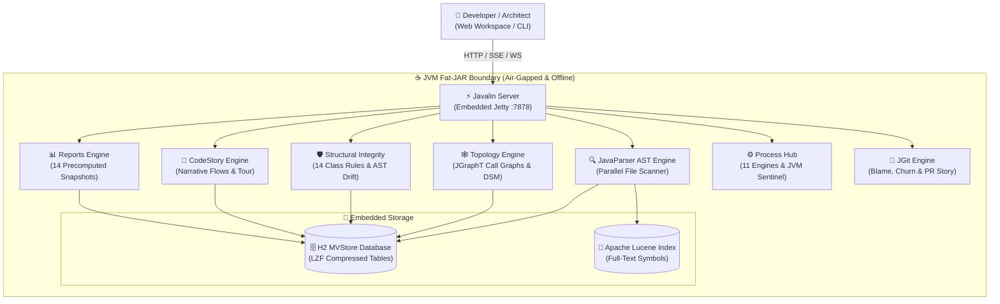

# Architecture & System Design

CodeLens is designed from first principles as an **enterprise-grade, 100% offline, air-gapped** codebase intelligence platform. It runs entirely on a standard Java 17+ JVM with **zero external cloud services, zero network egress, and zero external database servers**.

Interactive Archify HTML: [`docs/diagrams/architecture.html`](https://github.com/manvenpratap/codelens/blob/main/docs/diagrams/architecture.html)  
Specification: [`docs/diagrams/architecture.json`](https://github.com/manvenpratap/codelens/blob/main/docs/diagrams/architecture.json)



---

## 📦 Modular Subsystem Architecture

The codebase is structured into cohesive Maven submodules with clean directional dependencies:

```
codelens/
├── codelens-core/        Zero-dependency domain models, entities, and configuration
├── codelens-parser/      JavaParser 3.25.8 visitor, parallel scanner, and AST extraction
├── codelens-storage/     H2 database (MVStore LZF), HikariCP pool, and Apache Lucene index
├── codelens-analysis/    JGraphT directed graph, DSM matrices, coupling, and 32-rule reviewer
├── codelens-git/         JGit 6.9 engine, blame annotator, and Git PR change analyzer
├── codelens-api/         Javalin 6.1.3 REST endpoints, SSE streams, and CodeStory synthesis
├── codelens-web/         Zero-build static web resources (HTML5, ES6, Three.js, Monaco)
└── codelens-app/         Shaded fat-JAR bootstrap and CLI command suite
```

---

## 💾 Storage Subsystem & High-Scale Compaction

1. **Embedded H2 MVStore Database**:
   - Stores packages, types, methods, fields, relationships, and metadata in local file `./codelens-data/codelens_db.mv.db`.
   - Uses **LZF page compression** and single-transaction chunk commits to reduce disk usage by ~95% compared to raw relational storage.
   - Employs automated `SHUTDOWN COMPACT` execution to eliminate dead page fragmentation.

2. **Apache Lucene 9.10 Index**:
   - Maintains a high-speed, local inverted index of all symbol names, method signatures, field declarations, and Javadoc tokens.
   - Powers sub-10ms global fuzzy symbol searches (<kbd>⌘K</kbd>) across millions of code entities.

3. **In-Memory JGraphT Topology Core**:
   - Builds directed call graph representations in memory for instant multi-hop BFS traversal, shortest path calculation, and Tarjan cycle detection.
   - Caches sunflower spiral and 3D layout coordinates in `./codelens-data/graph-cache/` to guarantee instantaneous view switching without rendering lag.

---

## 🚀 High-Scale Performance Guarantees

* **125,000+ Class Scale**: Quotient graph aggregations roll up multi-level package hierarchies, while Level-of-Detail (LOD) culling discards sub-pixel nodes during rendering.
* **Non-Blocking Architecture**: Long-running ingestion, analysis, and report generation execute on background daemon pools, broadcasting live updates via Server-Sent Events (SSE).
* **Self-Healing Memory Controls**: The Process Hub monitors heap consumption via JMX. At 85% occupancy, it sheds non-essential in-memory caches; at 92%, it trips an automated circuit breaker to prevent `OutOfMemoryError`.
