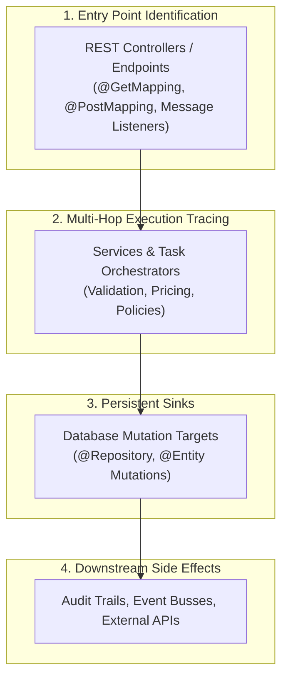

# CodeStory & Guided Tours

Rather than treating a codebase as an undifferentiated graph of thousands of classes, **CodeStory** transforms unfamiliar Java architectures into coherent, readable **transaction storylines** and progressive onboarding tours.

---

## 📖 1. Transaction Storylines

### Automated Workflow Extraction
CodeLens systematically detects entry points (Spring controllers, BaNCS business transactions, batch job runners) and traces their execution paths across domain services until reaching a persistent database sink (`save`, `update`, `delete`, or domain mutation methods).

### Narrative Synthesis
Each storyline is converted into a plain-English narrative explanation describing:
* **Business Intent**: What real-world transaction is taking place (e.g. Account Opening, Order Placement, Loan Disbursement).
* **Participant Roles**: Distinct archetype classifications (Controller, Domain Service, Task Step, Persistence Sink).
* **Line-Level Citations**: Direct links to precise lines in the Monaco code editor.
* **Blast Radius**: Downstream side effects, database tables touched, and event listeners triggered.

### Interactive Storyline Player & Stepper Dock
* **Chronological Flow Cards**: Each execution hop appears as a step card with sequence numbers, method names, cyclomatic complexity scores, and archetype badges.
* **Synchronized Canvas Focus**: Stepping through the flow (`‹` Prev / `›` Next) smoothly centers and pulses the graph canvas on each participating node.
* **Bidirectional Interaction**: Clicking any node in the graph highlights and scrolls to its step card in the player dock.

---

## 🎓 2. "Teach Me This Codebase" — 5-Layer Guided Onboarding Tour

The **Teach Me** tour guides new developers through unfamiliar codebases across 5 structured architectural layers:

| Layer | Focus Area | What You Learn |
|---|---|---|
| **Layer 1** | **Domain Core & Entities** | Core persistent entities, aggregates, and foundational business concepts. |
| **Layer 2** | **Ingestion & Storage** | Database access objects, repository interfaces, and data persistence contracts. |
| **Layer 3** | **Topology & Call Graphs** | High-traffic service orchestrators, task executors, and cross-module communications. |
| **Layer 4** | **Semantic Storylines** | End-to-end user journeys from external API boundaries to database commits. |
| **Layer 5** | **Intelligence & Risk Hotspots** | Behavioral hotspots, circular dependency hubs, and prioritized technical debt areas. |

Accessible via the web interface or terminal CLI (`java -jar codelens-app.jar teach-me`).

---

## 🔀 3. Git PR Change Story Generator

Compare branches or pull requests against a base reference (`main` or `release`) via `GET /api/git/pr-story?base=main&head=feature`:
* Generates an architectural narrative of what changed instead of raw code diffs.
* Highlights newly introduced API endpoints, modified persistent entity contracts, and widened blast radiuses.
* Produces Markdown summaries ready to paste into GitHub/GitLab pull requests.

---

## 🤖 4. Grounded AI Architecture Assistant

CodeLens incorporates an architectural Q&A assistant accessible via drawer or CLI (`codelens-app.jar ask "<question>"`):
* **Local Ollama Integration**: Compatible with local LLMs (DeepSeek-Coder, Llama 3, Qwen 2.5 Coder) via `http://localhost:11434` for 100% offline security.
* **OpenAI Compatible**: Connects to OpenAI or internal enterprise LLM gateways.
* **Deterministic Fallback**: Automatically falls back to a deterministic template engine that answers questions using pure static AST facts and graph queries when no LLM is configured.
