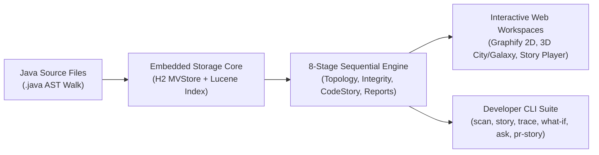

# Welcome to the CodeLens Documentation Wiki

**CodeLens** is a high-performance, **100% offline**, air-gapped Java codebase intelligence and architectural exploration platform. It transforms complex, unfamiliar, or monolithic Java repositories into intuitive, navigable architectural systems and human-readable **transaction storylines**.



---

## 📚 Wiki Navigation & Documentation Index

### 1. [Architecture & System Design](Architecture-and-System-Design)
Comprehensive overview of CodeLens's modular multi-JAR design, embedded zero-cloud philosophy, H2 MVStore LZF compression, Apache Lucene full-text symbol search, and in-memory JGraphT topology engine.

### 2. [8-Stage Scan Pipeline & Readiness](8-Stage-Scan-Pipeline-and-Readiness)
Detailed breakdown of the sequential 8-stage readiness pipeline (`PARSE`, `INDEX`, `GRAPH`, `LAYOUT`, `MODULES`, `INTEGRITY`, `CODESTORY`, `REPORTS`), incremental delta scans, progressive feature gating, and the central scan status modal.

### 3. [CodeStory & Guided Tours](CodeStory-and-Guided-Tours)
In-depth guide to transaction storylines, automated workflow synthesis from controllers to database mutation sinks, the interactive Storyline Player & Stepper Dock, the 5-layer "Teach Me This Codebase" onboarding tour, and Git PR change stories.

### 4. [Structural Integrity & Audits](Structural-Integrity-and-Audits)
Documentation of the 14 active class-awareness integrity rules, AST signature drift detection, duplicate body hash normalization, and the 32-rule static review auditor.

### 5. [Interactive Visualizations & 3D Studio](Interactive-Visualizations-and-3D-Studio)
Complete guide to 2D Graphify Canvas (Verlet physics & Sunflower spiral), 3D Software City (WebGL skyscrapers & thermal heat), 3D Galaxy, Hierarchical Treemap, Radial Sunburst, Dependency Structure Matrix (DSM) with method drilldown, and Chord diagram.

### 6. [Macro Architecture Studio](Macro-Architecture-Studio)
Package coupling analysis, Robert C. Martin's instability metrics ($I = C_e / (C_a + C_e)$), abstractness ($A$), distance from the main sequence ($D$), and inter-module dependency insights.

### 7. [Process Hub & JVM Sentinel](Process-Hub-and-JVM-Sentinel)
Live monitoring across all 11 asynchronous engines, memory circuit breaker heuristics, heap watchdog thresholds, database stress testing, and self-healing auto-recovery.

### 8. [Developer CLI & Toolsuite](Developer-CLI-and-Toolsuite)
Reference manual for headless CLI operations: `scan`, `story`, `trace`, `what-if`/`impact`, `ask`, `explain`, `teach-me`, and `pr-story`.

### 9. [REST & WebSocket API Reference](REST-and-WebSocket-API-Reference)
Complete, structured API documentation for all REST, Server-Sent Events (SSE), and WebSocket endpoints.

---

## ⚡ Quick Start

```bash
# Clone and build
git clone https://github.com/manvenpratap/codelens.git
cd codelens
./mvnw clean package -DskipTests

# Launch the server (opens http://localhost:7878)
java -jar codelens-app/target/codelens-app.jar

# Or run a headless scan directly from terminal
java -jar codelens-app/target/codelens-app.jar scan /path/to/java/project
```
