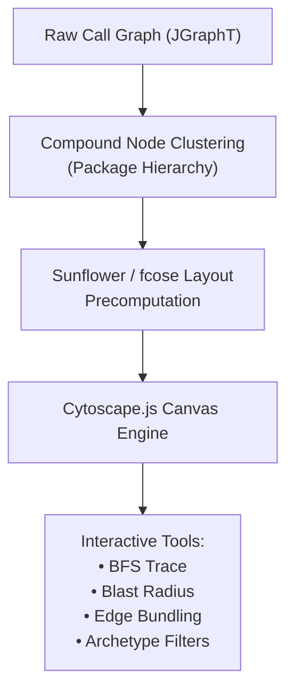

# Interactive Visualizations & 3D Studio

CodeLens provides a multi-dimensional visualization suite that translates raw Abstract Syntax Trees (ASTs) and directed call graphs into intuitive spatial representations. Rather than relying on static flat diagrams, developers and architects can explore codebases across 2D canvases, procedural 3D environments, hierarchical partitions, and dependency matrices.

---

## 🗺️ 2D Graphify Canvas (Cytoscape.js)

The **Graphify Canvas** is the primary 2D topological workspace for code exploration, call hierarchy tracing, and architectural impact analysis.



### Key Capabilities
* **Layout Engines**: Supports **Sunflower Spiral Layout** (deterministic disk-cached placement for massive graphs) and **fcose (Fast Compound Spring Embedder)** for dynamic force-directed clustering.
* **Compound Clustering**: Nodes are recursively nested inside transparent package and module boundary hulls, maintaining architectural context while exploring class interactions.
* **Level-of-Detail (LOD)**: Automatically collapses labels, minor edges, and method-level details during high-altitude zooming, maintaining smooth 60 FPS rendering on graphs with 10,000+ nodes.
* **Edge Bundling**: Reduces visual clutter across high-density dependencies by curving and grouping cross-package call pathways into cohesive visual highways.
* **Interactive Inspection**:
  * **Click**: Opens the Class/Method Inspector slideover with signature, fields, methods, and archetype tags.
  * **Double Click**: Zooms and isolates the immediate 1-hop caller/callee neighborhood.
  * **Right Click**: Context menu for "Trace Critical Path", "Simulate Blast Radius", or "Explain with AI".
  * **Multi-hop BFS**: Expand upstream or downstream neighbors up to $N$ hops with depth sliders.

---

## 🏙️ 3D Code City (Three.js WebGL)

The **3D Code City** applies an urban planning metaphor to visualize software scale, architectural quality, and complexity hotspots in a three-dimensional landscape.

```
       [Class Building]
         ┌─────────┐  ▲
         │         │  │ Height = LOC or Cyclomatic Complexity
         │         │  │
         │         │  ▼
      ┌──┴─────────┴──┐
      │  Base Width   │  Footprint = Method Count / Member Count
      └───────────────┘
  ───────────────────────── Ground District = Java Package
```

### Mapping Rules
| Dimension | Visual Property | Architectural Metric |
|---|---|---|
| **Districts / Blocks** | Ground planar islands | Java Package hierarchy / Maven modules |
| **Buildings** | 3D extruded cuboids | Java Classes / Interfaces / Records |
| **Building Height** | Vertical extrusion ($Y$-axis) | Lines of Code (LOC) or Cyclomatic Complexity ($v(G)$) |
| **Building Footprint** | Width & depth ($X/Z$ plane) | Number of declared methods and fields |
| **Building Color** | Surface material tint | **Archetype** (e.g. Controller: Cyan, Service: Violet, Repository: Emerald) or **Health Index** (Green: Clean $\to$ Red: Critical Debt) |
| **Streets & Plazas** | Inter-block spacing | Package boundary separation |

### Navigation & Controls
* **Orbit Camera**: Left-drag to orbit, right-drag to pan, scroll to zoom.
* **First-Person Flight**: Fly through package districts at street level to examine architectural monoliths.
* **Raycast Picking**: Hovering over any building highlights its bounding box and renders an overlay with class name, LOC, complexity, and incoming dependencies.
* **Wireframe Mode**: Toggles wireframe view to reveal internal package geometry and density distribution.

---

## 🌌 3D Code Galaxy (Three.js WebGL)

The **3D Code Galaxy** visualizes enterprise codebases as celestial solar systems, modeling architectural cohesion and coupling through gravitational mechanics.

* **Galactic Core**: Central gravitational hub representing shared core libraries, foundational utilities, and domain models.
* **Solar Systems (Clusters)**: Architectural modules orbiting the core at distances proportional to their architectural layer (Infrastructure/Adapters at the outer rim, Core Domain in inner orbits).
* **Planetary Bodies**: Individual classes with orbital sizes determined by method volume. Outer planetary satellites (moons) represent inner classes or helper delegates.
* **Particle Trails**: Glowing animated particle beams visualize live method invocation trajectories and bidirectional call traffic between planetary systems.

---

## 📊 Hierarchical Views: Treemap & Sunburst

When analyzing relative codebase volume and package composition without network link clutter, CodeLens provides two hierarchical partition layouts:

### 1. Squarified Treemap
* Nested rectangular tiles where rectangle area is proportional to class LOC or method count.
* Color gradients indicate code churn, bug density, or code smell concentration.
* Click any package rectangle to drill down into subpackages, classes, and inner classes.

### 2. Radial Sunburst
* Concentric rings representing hierarchical package depth from root (center) to leaf classes (outer rim).
* Angular sweep represents codebase proportion.
* Ideal for identifying top-heavy packages and bloated dependency trees at a single glance.

---

## 🧮 Dependency Structure Matrix (DSM)

The **Dependency Structure Matrix** provides a compact, mathematical representation of software coupling, dependency cycles, and layering violations.

```
┌──────────────────┬───┬───┬───┬───┐
│ Component        │ 1 │ 2 │ 3 │ 4 │
├──────────────────┼───┼───┼───┼───┤
│ 1. Controller    │ · │ 3 │ · │ · │  (1 calls 2)
│ 2. Service       │ · │ · │ 5 │ 2 │  (2 calls 3 and 4)
│ 3. Repository    │ · │ · │ · │ 1 │  (3 calls 4)
│ 4. Domain Model  │ 1 │ · │ · │ · │  <-- CYCLE! (4 calls 1: Highlighted in Red)
└──────────────────┴───┴───┴───┴───┘
```

### Features & Capabilities
* **Cell Values**: Numeric indicators denote the exact number of method call references from row to column.
* **Cycle Highlighting**: Off-diagonal feedback dependencies that violate strict layering (e.g., lower layers calling upper layers) are flagged in bright red.
* **Method-Level Drilldown**: Clicking any matrix cell opens an interactive drawer displaying every call site, caller method, callee method, and source line numbers.
* **Sorting & Partitioning**: Matrix rows can be reordered by Architectural Layer, Topological Order, or Afferent/Efferent Coupling density.

---

## 🕸️ Chord Diagram & Radial Flow

The **Chord Diagram** maps inter-package dependency relationships onto a circular radial layout:
* Outer arcs represent Java packages with arc lengths proportional to class counts.
* Directed ribbons connect dependent packages; ribbon width at each terminal represents outgoing versus incoming call counts.
* Interactive hover isolates a selected package, dimming unrelated arcs to spotlight coupling bridges and cross-module entanglement.
