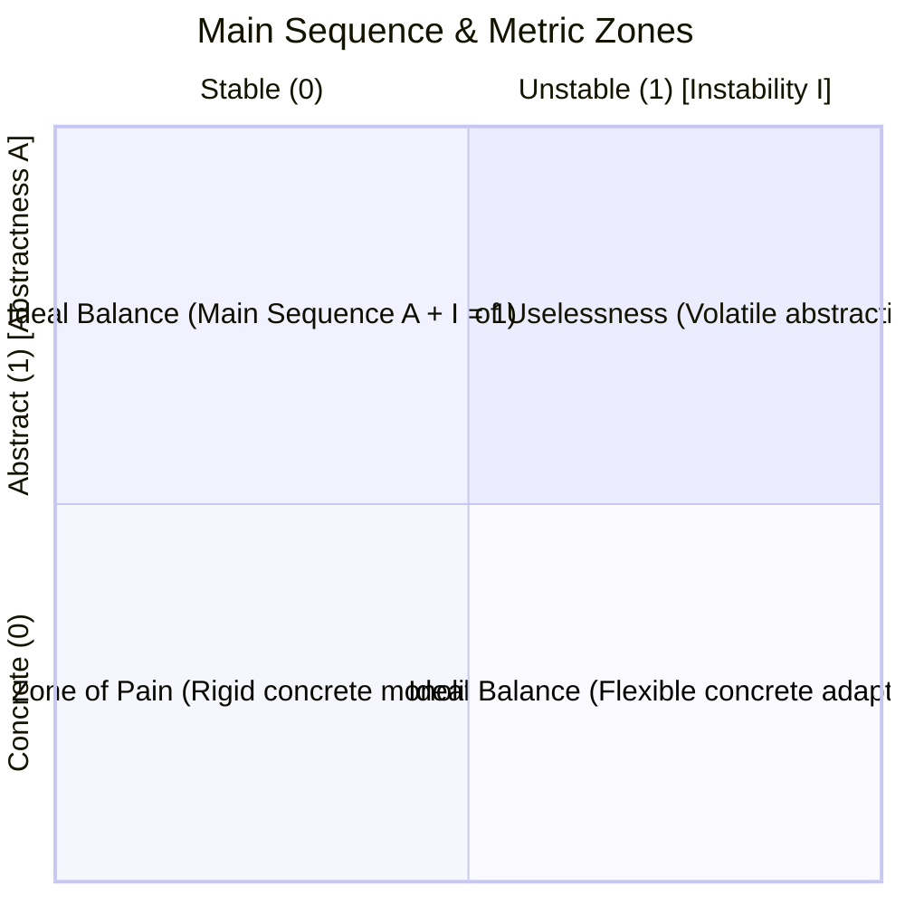

# Macro Architecture Studio

The **Macro Architecture Studio** is CodeLens's high-altitude observatory for package coupling, architectural boundaries, dependency direction, and architectural health metrics. It evaluates how software components interact at the package and module tier, ensuring systems stay modular and adhere to software design principles.

---

## 📐 Robert C. Martin's Package Metrics

CodeLens automatically computes package-level metrics defined in Robert C. Martin's *Clean Architecture* to measure stability, abstractness, and balance.

### 1. Afferent Coupling ($C_a$)
* **Definition**: The number of external classes outside this package that depend on classes within this package (incoming dependencies).
* **Significance**: Indicates the package's architectural responsibility and reuse factor. High $C_a$ means many callers break if this package changes.

### 2. Efferent Coupling ($C_e$)
* **Definition**: The number of external classes outside this package that classes within this package depend on (outgoing dependencies).
* **Significance**: Indicates package vulnerability. High $C_e$ means this package is fragile to changes across many upstream packages.

### 3. Instability Index ($I$)
$$I = \frac{C_e}{C_a + C_e} \quad (0 \le I \le 1)$$
* **$I = 0$ (Maximally Stable)**: Depended on by many components, but depends on no external packages. Changes here have high blast radius; package should be highly resistant to change.
* **$I = 1$ (Maximally Unstable)**: Depends on many external packages, but no external package depends on it. Easy to change and replace.

### 4. Abstractness Index ($A$)
$$A = \frac{N_a}{N_c} \quad (0 \le A \le 1)$$
* Where $N_a$ is the count of abstract classes and interfaces, and $N_c$ is the total class count in the package.
* Measures the degree of abstraction in the package.

### 5. Normalized Distance from the Main Sequence ($D$)
$$D = |A + I - 1| \quad (0 \le D \le 1)$$
The **Main Sequence** represents the optimal line where $A + I = 1$:
* **$D \approx 0$**: Healthy balance. Highly stable packages are appropriately abstract, and volatile packages are suitably concrete.
* **Zone of Pain ($A \to 0, I \to 0$)**: Packages that are highly concrete and heavily depended upon. They are rigid, difficult to extend, and expensive to refactor.
* **Zone of Uselessness ($A \to 1, I \to 1$)**: Highly abstract packages that no other packages depend on. Represents dead abstractions, speculative interfaces, or abandoned designs.

---

## 🏷️ Architectural Archetypes & Governance

During the 8-stage scan pipeline, CodeLens classifies every detected class into one of **11 Architectural Archetypes**:

| Archetype | Identifier Key | Detection Heuristics & Annotations | Architectural Role |
|---|---|---|---|
| **Controller** | `CONTROLLER` | `@RestController`, `@Controller`, JAX-RS `@Path`, GraphQL `@Controller` | HTTP/API Ingress; validates input, maps parameters |
| **Service** | `SERVICE` | `@Service`, `@Transactional`, business logic coordinators | Transaction orchestration, domain business rules |
| **Repository** | `REPOSITORY` | `@Repository`, Spring Data interfaces, JPA `EntityManager` DAOs | Data access layer; encapsulates database persistence |
| **Domain Entity** | `DOMAIN_ENTITY` | `@Entity`, `@Table`, Jakarta Persistence mappings | Core persistent business state and domain entities |
| **DTO** | `DTO` | Java `record`, `*Dto`, `*Request`, `*Response`, serialization models | Boundary data carrier without domain business methods |
| **Config** | `CONFIG` | `@Configuration`, `@Bean`, environment property mappers | Spring context bootstrap and externalized config |
| **Utility** | `UTIL` | Static method holders, final classes with private constructors | Reusable stateless helper functions |
| **Security** | `SECURITY` | `SecurityFilterChain`, `AuthenticationProvider`, JWT handlers | AuthN/AuthZ guards and token interceptors |
| **Client** | `CLIENT` | `@FeignClient`, `WebClient`, HTTP/gRPC remote proxies | Outbound integration with external downstream APIs |
| **Event Listener** | `EVENT_LISTENER`| `@EventListener`, `@KafkaListener`, `@RabbitListener` | Asynchronous message and event consumers |
| **Mapper** | `MAPPER` | MapStruct `@Mapper`, ModelMapper delegates, Converter functions| Object transformation between internal and external forms |

### Boundary Enforcement Rules
The Macro Architecture Studio enables development teams to declare and audit layer boundaries:
* `CONTROLLER` $\to$ `REPOSITORY`: **Blocked** (Controllers must call Services, never direct DAOs).
* `DOMAIN_ENTITY` $\to$ `DTO` / `CONTROLLER`: **Blocked** (Domain core must never leak references to external transport models).
* `REPOSITORY` $\to$ `SERVICE`: **Blocked** (Persistence layer must never depend on higher business logic).

Violations appear in both the **Macro Architecture Studio** and the **Structural Integrity Audit Tab** with immediate jump-to-source navigation.

---

## 🔄 Circular Dependency Detection (Tarjan's SCC)

Cycle entanglements degrade modularity, break independent compilation, and introduce runtime deadlocks:
1. CodeLens executes **Tarjan's Strongly Connected Components (SCC)** algorithm on the directed package dependency graph.
2. Identifies all closed feedback loops (e.g., Package A $\to$ Package B $\to$ Package C $\to$ Package A).
3. Surfaces cycle participants in an interactive dependency ring, highlighting the exact cross-package import edges responsible for closing the cycle.
4. Generates an automated decoupling strategy (e.g., extract shared interface to a third contract package, apply Dependency Inversion Principle).
