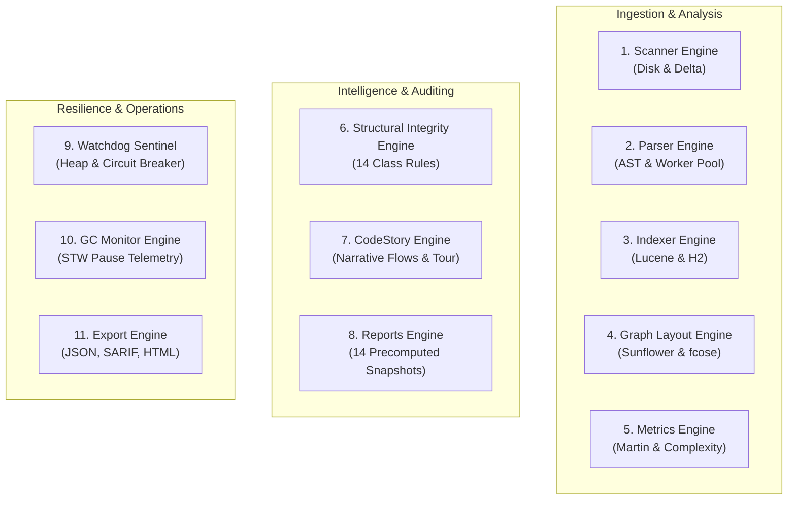

# Process Hub & JVM Sentinel

The **Process Hub & JVM Sentinel** is CodeLens's operational command center and runtime self-protection system. It provides live visibility into all 11 background processing engines, thread pool allocations, memory consumption, and circuit breaker states, ensuring system resilience even when analyzing massive multi-million-LOC repositories.

Interactive Archify HTML: [`docs/diagrams/architecture.html`](https://github.com/manvenpratap/codelens/blob/main/docs/diagrams/architecture.html)  
Lifecycle Specification: [`docs/diagrams/lifecycle.html`](https://github.com/manvenpratap/codelens/blob/main/docs/diagrams/lifecycle.html)

---

## ⚙️ The 11 Background Engines

CodeLens partitions all heavy computational tasks across **11 decoupled, isolated background engines**:



| Engine | Responsibility | Concurrency & Threading Model |
|---|---|---|
| **1. Scanner** | Fast file tree discovery, SHA-256 change hashing, delta manifest detection | Single-threaded I/O coordinator |
| **2. Parser** | AST parsing with JavaParser, extracting classes, methods, annotations | Configurable CPU-bound thread pool (`Runtime.getRuntime().availableProcessors()`) |
| **3. Indexer** | Inverted token indexing in Lucene and batch relational indexing in embedded H2 | Dedicated background disk I/O worker |
| **4. Graph Layout** | JGraphT topology construction and Sunflower/fcose coordinate solving | Off-heap memory cached worker |
| **5. Metrics** | Computes McCabe complexity, Halstead volume, and Martin package stability | Parallel stream analysis |
| **6. Structural Integrity** | Evaluates 14 class-awareness rules across the AST and call graph | Dedicated rule audit thread pool |
| **7. CodeStory** | Discovers entry points, traces sinks, and precomputes guided tours | Path-tracing worker with cycle limits |
| **8. Reports** | Pre-renders 14 analytical snapshots and offline visual reports | Sequential report generation runner |
| **9. Watchdog Sentinel** | Polling JVM memory, heap limits, and circuit breaker trip conditions | High-priority daemon timer (1,000ms tick) |
| **10. GC Monitor** | Subscribes to JMX `GarbageCollectorMXBean` notifications for STW tracking | JMX notification listener thread |
| **11. Export** | Formats and writes SARIF, JSON, CSV, SVG, and HTML bundle exports | Ad-hoc on-demand executor |

---

## 🛡️ JVM Sentinel & Memory Watchdog

To prevent `OutOfMemoryError` (OOM) and JVM unresponsiveness during heavy codebase scans, the **JVM Sentinel** constantly monitors memory telemetry:

```
0% ──────────── 75% ─────────────── 88% ───────────── 100%
     HEALTHY          WARNING            TRIPPED
   [  Normal  ]   [ Evict Caches ]   [ Shed Ingestion ]
                  [ Proactive GC ]   [ Circuit Breaker OPEN ]
```

### Telemetry Thresholds
1. **Normal State ($< 75\%$ Heap Used)**: All 11 engines operate at full parallel capacity. Layouts and AST trees remain cached in memory for sub-millisecond retrieval.
2. **Warning State ($75\% - 88\%$ Heap Used)**:
   * Triggers proactive eviction of soft caches (precomputed layout coordinates, intermediate AST trees).
   * Notifies the garbage collector to reclaim ephemeral structures.
   * UI status badge transitions to amber warning.
3. **Tripped State ($> 88\%$ Heap Used)**:
   * **Circuit Breakers Trip to `OPEN`**: Heavy ingestion and report tasks are paused immediately.
   * In-flight AST workers are throttled or gracefully shed.
   * Prevents total JVM crash; preserves read operations and UI responsiveness.

---

## ⚡ Circuit Breakers & States

Every resource-intensive pipeline step is guarded by a deterministic circuit breaker:

| State | Behavior |
|---|---|
| **`CLOSED`** | Normal execution. All operations pass through to engine worker threads. |
| **`OPEN`** | Failed requests or critical heap alarms trip the breaker. Calls fail-fast with `503 Service Unavailable` or enter safe degradation queues instead of crashing the JVM. |
| **`HALF_OPEN`** | Once memory stabilizes below 70% for over 5 seconds, canary requests are allowed through to verify memory recovery before closing the breaker. |

---

## 🧰 Process Hub Web Modal & Controls

The **Process Hub Modal** (<kbd>⌘P</kbd> or clicking the top-bar Sentinel status pill) provides comprehensive runtime administration:

* **Tab 1: Background Tasks**: Real-time list of all active, queued, and completed jobs with elapsed time, progress bar, CPU consumption, and kill buttons.
* **Tab 2: Database & Storage**: Embedded H2 table row counts, disk database size, cache hit ratio, and an instant **"Purge & Compact"** button.
* **Tab 3: Engine Fleet**: Status cards for each of the 11 engines (`IDLE`, `RUNNING`, `THROTTLED`, `ERROR`) with direct pause/resume toggles.
* **Tab 4: Server & Telemetry**: Live JVM heap gauge bar, uptime, GC pause frequency, active thread count, and system CPU load.

### Emergency Recovery Actions
* **`POST /api/process/cache/purge`**: Immediately drops all soft layout caches and runs proactive garbage collection.
* **`POST /api/process/circuit-breaker/reset`**: Manually forces all tripped circuit breakers back to `CLOSED`.
* **`POST /api/process/stress-test`**: Executes a 3-second synthetic stress test to calibrate engine thread pool limits against available host memory.
